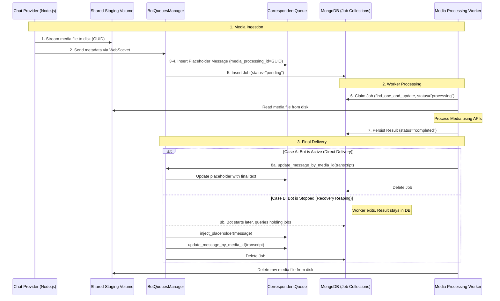

# Multimedia Message Type Support

## Problem Statement

When media messages (video, audio, image) arrive, converting them to text can take up to a minute. Holding the bot's message pipeline while processing would:
- Block all subsequent messages for that correspondent
- Explode memory if multiple heavy files arrive simultaneously

## Design Overview

Messages flow from any Chat Provider → `BotQueuesManager` → `CorrespondentQueue`. The solution adds a non-blocking processing layer at the `BotQueuesManager` level, keeping it **provider-agnostic** ("one implementation, fits all providers").

---

## Message Schema Change

Add `media_processing_id: Optional[str]` to the `Message` dataclass (alongside existing fields: `id`, `content`, `sender`, `source`, `accepted_time`, `message_size`, `originating_time`, `group`, `provider_message_id`).

| Field | Value during processing | Value when done |
|---|---|---|
| `content` | Caption text if provided, otherwise `""` | Caption + appended transcript/description |
| `media_processing_id` | GUID (e.g. `"a3f2-..."`) | `None` (removed) |
| `message_size` | `len(caption)` or `0` | `len(final content)` |

---

## Shared Media Volume & Storage Quota

A shared Docker volume (`media_staging`) is mounted into both the Baileys Node.js server and the Python backend at `media_store/pending_media/`. This allows the Node.js server to stream media files directly to disk, and the Python backend to read and delete them — **zero media bytes are exchanged between containers over the network**.

To prevent media downloads from exhausting the host's primary disk, an application-level quota is enforced. The limit is defined by the `media_storage_quota_gb` property in the configuration collection.

**Runtime retrieval path (mandatory):** the Python backend resolves `media_storage_quota_gb` from MongoDB and passes it to the Node.js Baileys service in the `/initialize` payload. Node.js does not read this value directly from MongoDB.

```yaml
# docker-compose.yml
services:
  whatsapp_baileys_server:
    user: "${CURRENT_UID}:${CURRENT_GID}"  # Auto-detected by ./scripts/start.sh
    volumes:
      - media_staging:/app/media_store/pending_media

  backend:
    user: "${CURRENT_UID}:${CURRENT_GID}"  # Same UID/GID as host user
    volumes:
      - media_staging:/app/media_store/pending_media

volumes:
  media_staging:
```

### Permissions & Ownership (The Deployment Sentry)
To avoid "Permission Denied" errors (EACCES) on shared volumes, both containers must match the identity of the host user who owns the project files. 

- **The Strategy**: Use dynamic environment variables `${CURRENT_UID}:${CURRENT_GID}` for the `user` field in `docker-compose.yml`.
- **The Rationale**: Since bind mounts (like `baileys_store`) inherit the host's UID/GID, hardcoding `1000:1000` is risky if the host VM uses a different ID.
- **The Implementation**: `./scripts/start.sh` must auto-detect the host identity (`id -u` and `id -g`) and export `CURRENT_UID` / `CURRENT_GID` into `.env` **before** `docker compose up`.
- **The Result**: Files written by the Node.js server are immediately reachable and manageable by the Python `MediaProcessingService` regardless of the host OS configuration.

> [!TIP]
> This pattern ensures "zero-touch" deployment security—the system auto-sets its permissions the moment you run the startup command. 🛡️

---

## Flow for a Media Message

1. **Node.js receives media** → generates a GUID, streams the media to disk at `media_store/pending_media/<guid>` using Baileys' streaming API (`downloadMediaMessage(msg, 'stream')`). Media bytes never fully load into Node.js memory.
2. **Node.js sends metadata to Python** via WebSocket — only the GUID, mime type, caption, and original filename. No media bytes cross the wire.
3. **Python provider receives metadata** → calls `BotQueuesManager.add_message()` with the media params (GUID, mime type, caption, filename).
4. **Placeholder insertion**: `BotQueuesManager` adds a `Message` to the `CorrespondentQueue` with `content=<caption>` (or `""`) and `media_processing_id=<guid>`. No file validation is performed — if the file is missing or corrupt, the processor handles the implications.
5. **Non-blocking processing trigger**: `BotQueuesManager.add_message()` writes a job record to the **`media_processing_jobs`** MongoDB collection. This is the job submission — `MediaProcessingService` worker pools (each with a dedicated media processor per mime type) poll this collection for work. Each job record contains:
   - `bot_id` — **top-level field** injected alongside the message, identifying which bot owns this job (used for lifecycle transitions and routing back to the correct `BotQueuesManager`)
   - `correspondent_id` — **top-level field** injected alongside the message, identifying which `CorrespondentQueue` holds the placeholder
   - `placeholder_message` — the full serialized `Message` placeholder dict (which contains message-oriented fields like `id`, `content`, `media_processing_id`, `sender`, etc., but **does not** contain routing IDs like `bot_id` or `correspondent_id` since those do not exist on the `Message` dataclass)
   - `guid` — used to locate the raw media file at `media_store/pending_media/<guid>`
   - `original_filename` *(optional)* — provided by the provider if available; used to assist processing (e.g. file extension hints)
   - `mime_type` — determines which processing pool to route the job to
   - `status` — **"pending"** (default), **"processing"** (claimed by worker), or **"completed"** (result saved, awaiting delivery)
   - `result` — *(optional)* The finalized transcript or description text, populated when `status == "completed"`

6. **Worker claims job**: The `MediaProcessingService` uses an **atomic `find_one_and_update`** to claim a job where `status == "pending"`. It sets `status = "processing"` and assigns a `worker_id`. This atomic action ensures that even if 100 jobs move to the active queue at once, no two workers will ever pick up the same task. If a bot resets mid-job, the job remains in `"processing"` state, signaling other workers to stay away.

7. **Processing completes (Result Persistence)**: The worker performs its AI mission, then **immortalizes the result** in the database. It attempts an atomic update on the job record to set `status = "completed"` and `result = transcript`. It tries the `media_processing_jobs` (active) collection first; if not found (bot stopped), it tries `media_processing_jobs_holding`.

8. **Final Reporting (Delivery vs. Reaping)**: Once the result is safely persisted in the DB, the worker attempts to complete the mission:
   - **Case A: Direct Worker Delivery** (Bot is Active): The worker locates the `BotQueuesManager` and calls its `update_message_by_media_id(correspondent_id, guid, transcript)` method (which delegates the update to the specific `CorrespondentQueue` instance). The job is then **deleted**.
   - **Case B: Recovery Bot Reaping** (Bot is Stopped): The worker finds no active bot and gracefully exits. The job remains in the **`media_processing_jobs_holding`** collection with `status="completed"`. When the bot eventually restarts, it **reaps** the result from the holding collection, injects the placeholder, updates its queue via `update_message_by_media_id`, and **deletes the job**.
   - On completion (via either path), the **worker** deletes the raw media file from the shared disk.

### Media Flow Sequence Diagram



---

## Node -> Python WebSocket Payload Contract

This is a wire-level contract (cross-runtime boundary): **Node.js -> WebSocket JSON -> Python**.

### Text message payload

Required fields:
- `provider_message_id: str`
- `sender: str`
- `message: str`
- `direction: "incoming" | "outgoing"`
- `originating_time: int`

Optional fields:
- `display_name: str | null`
- `group: object | null`
- `alternate_identifiers: list[str]`
- `recipient_id: str | null`
- `actual_sender: object | null`
- `media_processing_id: null`
- `mime_type: null`
- `original_filename: null`

### Media message payload (download succeeded)

Required fields:
- All required text fields above
- `message: str` (caption, or `""` if none)
- `media_processing_id: str` (GUID)
- `mime_type: str`

Optional fields:
- `original_filename: str | null`

### Corrupt/failed-download media payload

Required fields:
- All required text fields above
- `message: str` (caption, or `""`)
- `media_processing_id: str` (GUID)
- `mime_type: "media_corrupt_<type>"` (where `type` is one of: `image`, `video`, `audio`, `document`, `sticker`)

Optional fields:
- `original_filename: str | null`
- `_quota_exceeded: bool` (diagnostic marker)

Python should validate this WS payload contract (preferably via an internal typed model) before mapping to `BotQueuesManager.add_message(...)`.

---

## Provider Interface for Media Messages

The existing `add_message()` method on `BotQueuesManager` is extended with optional media parameters:

```python
async def add_message(
    self,
    correspondent_id: str,                  # Required routing key (queue owner)
    content: str,                          # if a regular text message, will contain the text. If a media message, will contain the caption text if provided, or empty string if no caption is provided
    sender: Sender,
    source: str,
    originating_time: Optional[int] = None,
    group: Optional[Group] = None,
    provider_message_id: Optional[str] = None,
    # --- New optional media params ---
    media_processing_id: Optional[str] = None,  # GUID — file already on shared volume
    mime_type: Optional[str] = None,
    original_filename: Optional[str] = None,
    media_metadata: Optional[Dict[str, Any]] = None  # Diagnostic flags like _quota_error
)
```

If `media_processing_id` and `mime_type` are provided, the media pipeline kicks in (placeholder → job). If not, the message is treated as plain text. This is the **single entry point** for all providers — the provider's job ends after calling this method.

### `inject_placeholder(message: Message)`

A separate low-level method on `CorrespondentQueue` that directly inserts a pre-constructed `Message` object. Unlike `add_message()`, it:
- Does **not** generate a new message ID — uses the ID from the provided `Message`.
- Does **not** truncate content.
- Does **not** fire `_trigger_callbacks`.
- Does **not** re-enter the media pipeline.

Used exclusively by:
- **Crash recovery / bot startup** — re-injecting deserialized placeholders from `media_processing_jobs_holding` into the in-memory `CorrespondentQueue` when a bot connects and its jobs are moved back to `media_processing_jobs`.

### Required Change in `server.js` (Baileys Node.js Server)

First, add `crypto`, `exec` (from `child_process`), and `util` to the imports at the top of the file:

```javascript
const crypto = require('crypto');
const util = require('util');
const execAsync = util.promisify(require('child_process').exec);
const {
    // ... existing imports ...
    downloadMediaMessage
} = require('@whiskeysockets/baileys');
```

Then, the current `processMessage` function discards media and captions:

```javascript
// CURRENT — media is lost, caption is lost
let messageContent = msg.message.conversation || msg.message.extendedTextMessage?.text;
if (!messageContent) {
    messageContent = `[User sent a non-text message: ${type}]`;
}
```

This must be updated to detect media types, extract the caption, stream the media to the shared volume, and return only metadata:

```javascript
// NEW — stream media to shared volume, return only metadata
const mediaTypes = {
    imageMessage:    { caption: msg.message.imageMessage?.caption },
    videoMessage:    { caption: msg.message.videoMessage?.caption },
    audioMessage:    { caption: null },  // audio has no caption
    documentMessage: { caption: msg.message.documentMessage?.caption },
    stickerMessage:  { caption: null },  // stickers have no caption
};

const mediaInfo = mediaTypes[messageType];  // messageType already resolved above (line 387)

if (mediaInfo !== undefined) {
    const guid = crypto.randomUUID();
    const mimetype = msg.message[messageType]?.mimetype;
    const filename = msg.message[messageType]?.fileName || null;
    const caption = mediaInfo.caption || '';
    const writePath = path.join('/app/media_store/pending_media', guid);

    // Enforce configurable application-level quota before downloading.
    // `media_storage_quota_gb` is provided by backend in `/initialize` payload.
    const configuredLimitGb = session.providerConfig?.media_storage_quota_gb || 25; // fallback
    // Calculate threshold: limit - 2 GB, but ensure at least 1 GB is available for operations
    const stopWritingThresholdGb = Math.max(configuredLimitGb - 2, 1);
    const stopWritingThresholdMb = stopWritingThresholdGb * 1024;

    try {
        // ASYNC to prevent freezing the single-threaded event loop
        const { stdout } = await execAsync('du -sm /app/media_store/pending_media');
        const sizeOutput = stdout.toString().split('\t')[0];
        const currentSizeMb = parseInt(sizeOutput, 10);
        
        if (currentSizeMb > stopWritingThresholdMb) {
            console.error(`Media quota exceeded (Current Size: ${currentSizeMb}MB, Threshold: ${stopWritingThresholdMb}MB). Rejecting download for ${guid}`);
            
            // Treat quota exhaustion exactly like a corrupt/failed download
            const baseType = messageType.replace('Message', ''); // e.g. 'image'
            const corruptMimetype = `media_corrupt_${baseType}`;
            
            return {
                ...existingFields, // spread common metadata: provider_message_id, sender, direction, time, etc.
                message: caption,
                media_processing_id: guid,
                mime_type: corruptMimetype,
                original_filename: filename,
                _quota_exceeded: true
            };
        }
    } catch (error) {
        console.error(`Failed to calculate media directory size for ${guid}: ${error.message}. Rejecting download.`);
        const baseType = messageType.replace('Message', '');
        const corruptMimetype = `media_corrupt_${baseType}`;
        return {
            ...existingFields, // spread common metadata
            message: caption,
            media_processing_id: guid,
            mime_type: corruptMimetype,
            original_filename: filename,
            _quota_exceeded: true // diagnostic marker for system error
        };
    }
    // --- Proceed with Retry Logic ---    // Retry up to 3 times with exponential back-off (2s, 4s, 8s)
    let downloaded = false;
    let quotaExceeded = false;
    for (let attempt = 1; attempt <= 3; attempt++) {
        try {
            const stream = await downloadMediaMessage(msg, 'stream', {});
            const writeStream = fs.createWriteStream(writePath);
            await new Promise((resolve, reject) => {
                stream.pipe(writeStream);
                writeStream.on('finish', resolve);
                writeStream.on('error', reject);
            });
            downloaded = true;
            break;
        } catch (err) {
            // Delete any partially-written file before retrying/aborting
            try { fs.unlinkSync(writePath); } catch (_) {}
            
            // Optional: fallback if disk physically fills completely
            if (err.code === 'ENOSPC') {
                console.error(`Media quota exceeded (ENOSPC). Rejecting download for ${guid}`);
                quotaExceeded = true;
                break; // Do not retry if disk is physically full
            }

            if (attempt < 3) {
                await new Promise(r => setTimeout(r, 2000 * Math.pow(2, attempt - 1)));
            } else {
                console.error(`Media download failed after 3 attempts for ${guid}: ${err.message}`);
            }
        }
    }

    if (downloaded) {
        // Return only metadata — no bytes cross the wire to Python
        return {
            ...existingFields, // spread common metadata (sender, id, time, etc.)
            message: caption,
            media_processing_id: guid,
            mime_type: mimetype,
            original_filename: filename,
        };
    } else {
        // All retries failed OR quota exceeded — send as corrupted media
        // mediaType is e.g. "image", "video", "audio" (strip "Message" suffix)
        const shortType = messageType.replace('Message', '');
        return {
            ...existingFields, // spread common metadata
            message: caption,                              // caption if exists, else ''
            media_processing_id: guid,
            mime_type: `media_corrupt_${shortType}`,       // e.g. "media_corrupt_image"
            original_filename: filename,
            _quota_exceeded: quotaExceeded                 // Optional marker for deeper logging upstream
        };
    }
}
```

The Python `whatsAppBaileys.py` provider passes the metadata (GUID, mime type, filename) to `add_message()`. No bytes are decoded or transferred.

## MediaProcessingService (Background Worker Pool)

A fixed-concurrency pool to avoid memory bloat and starvation across bots. **All media messages enter the pipeline identically** — every media message becomes a placeholder in the relevant CorrespondentQueue and also a job in `media_processing_jobs`. Independent worker pools each populated with specific type of worker implementing BaseMediaProcessor subclass then **select and claim** jobs based on their configured mime-types at a concurrency configured per worker pool. Text messages bypass this service entirely and go straight to the queue.

### Service Ownership and Lifecycle Wiring

- `MediaProcessingService` is initialized in backend `main.py` lifespan during startup (after MongoDB init), stored on global state (e.g. `global_state.media_processing_service`), and started before active bots are launched.
- On startup, it performs the same recovery phase described in this spec (`media_processing_jobs -> media_processing_jobs_holding`, then `processing -> pending`).
- It is stopped during backend shutdown in lifespan teardown.
- Bot lifecycle hooks are owned by `BotLifecycleService`:
  - on bot connect: trigger holding->active media transition/reaping flow for that specific bot's jobs
  - on bot disconnect: trigger active->holding media transition for that specific bot's jobs
- Runtime resolver API for queue routing:
  - `get_bot_queues(bot_id) -> Optional[BotQueuesManager]`
  - implementation uses global state maps (`active_bots` and `chatbot_instances`) to resolve `bot_id -> SessionManager -> bot_queues_manager`

### Processor Routing

| Mime type | Processor | Action |
|---|---|---|
| `audio/ogg`, `audio/mpeg` | Audio pool | speech-to-text API → transcript |
| `video/mp4`, `video/webm` | Video pool | vision/transcription API → description |
| `image/jpeg`, `image/png`, `image/webp` | Image pool | vision API → text description |
| `application/pdf`, `text/plain`, etc. | Document pool | text extraction API → plain text |
| `image/webp` (stickers) | Sticker pool | vision/metadata extraction → description |
| `media_corrupt_image`, `media_corrupt_audio`, `media_corrupt_video`, `media_corrupt_document`, `media_corrupt_sticker` | `CorruptMediaProcessor` | error handling (see below) |
| *anything else* (e.g. `text/calendar`)| `UnsupportedMediaProcessor` (default catch-all) | error handling (see below) |

### Corrupted Media Handling (`CorruptMediaProcessor`)

When `server.js` fails to download media after **3 retry attempts** (exponential back-off: 2s → 4s → 8s), it deletes any partially-written file and sends metadata to Python with `mime_type = "media_corrupt_<type>"` (where `<type>` is `image`, `video`, `audio`, `document`, or `sticker`). The `content` field carries the original caption if one exists, otherwise an empty string. The message enters the queue as a placeholder like any other media message.

The `CorruptMediaProcessor` handles these jobs:
1. Deletes the media file from the shared volume (if one exists).
2. Moves the job to `media_processing_jobs_failed` with `error: "download failed — <type> corrupted"` (e.g., `image corrupted`) for operator investigation.
3. Constructs the final message content:
   - If the placeholder has a caption: prepend `"[Corrupted <type> media could not be downloaded] "` to the existing caption.
   - If no caption: set `content = "[Corrupted <type> media could not be downloaded]"`.
4. Updates the placeholder in the `CorrespondentQueue` via `update_message_by_media_id` — (which is a method of `CorrespondentQueue` class that sets the final `content`, clears `media_processing_id`, adjusts `message_size`, and fires `_trigger_callbacks` so the bot can acknowledge and respond to the failure.)
5. Job is removed from `media_processing_jobs`.

### Unsupported Media Handling (`UnsupportedMediaProcessor`)

The `UnsupportedMediaProcessor` is the **default catch-all** — it handles any mime type that no other pool is configured to process. Since `server.js` sends the original mime type as-is (e.g. `text/calendar` (ICS files), `application/x-zip`), it has no knowledge of what the backend supports. The unsupported type detection happens naturally at the processor routing level: if no pool matches the mime type, it falls to the default.

The `UnsupportedMediaProcessor` follows the same pattern as `CorruptMediaProcessor`:
1. Deletes the media file from the shared volume.
2. Moves the job to `media_processing_jobs_failed` with `error: "unsupported mime type: <mime_type>"` for operator investigation.
3. Constructs the final message content:
   - If the placeholder has a caption: prepend `"[Unsupported <mime_type> media] "` to the existing caption.
   - If no caption: set `content = "[Unsupported <mime_type> media]"`.
4. Updates the placeholder in the `CorrespondentQueue` via `update_message_by_media_id` — (which is a method of `CorrespondentQueue` class that sets the final `content`, clears `media_processing_id`, adjusts `message_size`, and fires `_trigger_callbacks` so the bot can acknowledge and respond to the failure.)
5. Job is removed from `media_processing_jobs`.

This keeps backend and provider fully decoupled — `server.js` never needs to know what mime types the backend supports.

### Concurrency Configuration & Pull-Based Selection

Pool definitions are loaded from the `bot_configurations` MongoDB collection, document `_id: "_mediaProcessorDefinitions"`. On startup, the `MediaProcessingService` creates one pool per entry.

**Selection Logic (Single-Skip Two-Step)**: To ensure fairness across bots without heavy database grouping, each worker maintains a `self.last_bot_id` in its local memory. When polling for work, the worker executes a two-step "Fairness-First" selection:

1.  **Step 1: Fairness Search**: The worker attempts to claim the oldest pending job where `bot_id != self.last_bot_id` (matching its mime-type specialty).
2.  **Step 2: Fallback (Throughput Safety)**: If Step 1 returns nothing (only the last-served bot has work), the worker immediately attempts to claim the oldest pending job from **any** bot (including `self.last_bot_id`).

This "Skip-if-Choice" strategy prevents a noisy bot from occupying a worker's entire capacity while there are other bots waiting, but guarantees that no worker sits idle if only one bot has a backlog. Upon claiming a job, the worker updates its `self.last_bot_id` with the new job's `bot_id`.

This ensures that a single noisy bot cannot occupy more than its fair share of the pool unless the rest of the kingdom is silent.

The configuration document contains an array of pool definitions:

```json
[
  { "mimeTypes": ["audio/ogg", "audio/mpeg"], "processorClass": "AudioTranscriptionProcessor", "concurrentProcessingPoolSize": 2, "processingTimeoutSeconds": 300 },
  { "mimeTypes": ["video/mp4", "video/webm"], "processorClass": "VideoDescriptionProcessor", "concurrentProcessingPoolSize": 1, "processingTimeoutSeconds": 600 },
  { "mimeTypes": ["image/jpeg", "image/png"], "processorClass": "ImageVisionProcessor", "concurrentProcessingPoolSize": 3, "processingTimeoutSeconds": 120 },
  { "mimeTypes": ["application/pdf", "text/plain"], "processorClass": "DocumentProcessor", "concurrentProcessingPoolSize": 2, "processingTimeoutSeconds": 120 },
  { "mimeTypes": ["image/webp"], "processorClass": "StickerProcessor", "concurrentProcessingPoolSize": 2, "processingTimeoutSeconds": 60 },
  { "mimeTypes": ["media_corrupt_image", "media_corrupt_audio", "media_corrupt_video", "media_corrupt_document", "media_corrupt_sticker"], "processorClass": "CorruptMediaProcessor", "concurrentProcessingPoolSize": 1, "processingTimeoutSeconds": 10 },
  { "mimeTypes": [], "processorClass": "UnsupportedMediaProcessor", "concurrentProcessingPoolSize": 1, "processingTimeoutSeconds": 10 }
]
```

- `processorClass` — the Python class name that the service instantiates to handle messages in this pool.
- `processingTimeoutSeconds` — the mission-limit enforced by the `BaseMediaProcessor` (defaulting to 60s if omitted).
- `mimeTypes: []` — the **catch-all** entry. Any mime type not matched by any other pool is routed here. There must be exactly one catch-all entry.

On startup, `MediaProcessingService` creates one worker pool per array entry, sized to `concurrentProcessingPoolSize`, instantiating the specified `processorClass` and **passing the `mimeTypes` array to its constructor**. Fairness is enforced via the **Last-Bot Skip** selection mechanism described above.

### Observability

To help diagnose backpressure and pipeline health, the `MediaProcessingService` logs the **queue depth per pool** on each poll cycle. By counting the number of pending jobs in `media_processing_jobs` grouped by `mime_type` (or mapped to their respective processor pool), operators can monitor if a specific pool (e.g., video processing) is falling behind.

### Memory Behavior During Processing

- **Audio**: Streamed from disk using a file handle (`open(file, 'rb')`). `httpx` uploads in chunks — the full audio is never loaded into Python heap. Genuinely low-memory.
- **Video**: Gemini's File API accepts a streaming upload (disk → network), returning a URI used for subsequent LLM calls — low-memory.
- **Image**: Base64-encoded before sending to vision APIs (full image bytes in memory). Acceptable given typical image sizes.

---

## Media Processor Interface

All processors inherit from `BaseMediaProcessor`, which encapsulates the full job lifecycle. Subclasses only implement the actual media-to-text conversion.

### Typed Data Models

The media pipeline uses strong-typed dataclasses (defined in `infrastructure/models.py` or similar) to ensure technical precision and IDE safety.

```python
@dataclass
class MediaProcessingJob:
    job_id: Any                    # MongoDB _id (ObjectId or string)
    bot_id: str
    correspondent_id: str
    placeholder_message: Message   # Fully deserialized Message object from queue_manager
    guid: str                      # used to find the file
    mime_type: str
    status: str                    # "pending", "processing", "completed"
    original_filename: Optional[str] = None
    media_metadata: Dict[str, Any] = field(default_factory=dict) # Field report: raw diagnostic flags
    result: Optional[str] = None   # Final transcript or description
    error: Optional[str] = None    # Final verdict: human-readable failure reason

@dataclass
class ProcessingResult:
    content: str                          # Final message content for the queue
    failed_reason: Optional[str] = None   # If set, maps to job.error and moves job to _failed
```

### `BaseMediaProcessor` (Abstract Base Class)

Only `process_media` is abstract. All other methods are **concrete shared logic** implemented once in the base class — subclasses inherit them for free.

```python
class BaseMediaProcessor(ABC):
    def __init__(self, handled_mime_types: List[str], processing_timeout: float = 60.0):
        """Initialized once per pool with specialized types and a mission-limit."""
        self.handled_mime_types = handled_mime_types
        self.processing_timeout = processing_timeout

    async def process_job(self, job: MediaProcessingJob, all_bot_queues: Dict[str, BotQueuesManager], db: AsyncIOMotorDatabase):
        """Full shared lifecycle — called by the worker pool for each job."""
        file_path = f"media_store/pending_media/{job.guid}"

        try:
            # 1. ACTUAL CONVERSION (Externally Guarded by Centralized Timeout)
            try:
                result = await asyncio.wait_for(
                    self.process_media(file_path, job.mime_type, job.placeholder_message.content, job.media_metadata),
                    timeout=self.processing_timeout
                )
            except asyncio.TimeoutError:
                result = ProcessingResult(
                    content="[Processing timed out]",
                    failed_reason=f"TIMEOUT: Vision/Audio processing exceeded {self.processing_timeout}s"
                )

            # 2. PERSISTENCE (The Save Point)
            if result.failed_reason:
                # FAILURE PATH: Move to failed collection immediately
                await self._move_to_failed(job, result, db)
            else:
                # SUCCESS PATH: Mark as 'completed' so it can be reaped if bot crashes
                persisted = await self._persist_result_first(job, result, db)
                if not persisted:
                    return # Likely cleaned up or moved by another process

            # 3. Best-effort direct delivery for ALL paths
            bot_queues = all_bot_queues.get(job.bot_id)
            if bot_queues:
                # Deliver transcript OR error text "[Corrupted...]" to active bot
                await bot_queues.update_message_by_media_id(job.correspondent_id, job.guid, result.content)

                # 4. FINAL CLOSURE: only delete the SUCCESSFUL job once delivered
                # (Failed jobs were already moved/removed by _move_to_failed)
                if not result.failed_reason:
                    await self._remove_job(job, db)

        except Exception as e:
            # Catch ANY failure (conversion, DB, or delivery) to ensure dead-lettering
            await self._handle_unhandled_exception(job, db, error=str(e))
        finally:
            # GUARANTEE: The media file is always removed from the shared terrain
            self._delete_media_file(file_path)

    @abstractmethod
    async def process_media(self, file_path: str, mime_type: str, caption: str, media_metadata: Dict[str, Any]) -> ProcessingResult:
        """Subclass implements ONLY this: actual AI/conversion logic."""
        ...

    # --- Inherited Concrete Methods (Implemented once in Base class) ---

    async def _persist_result_first(self, job: MediaProcessingJob, result: ProcessingResult, db: AsyncIOMotorDatabase) -> bool:
        """Durable state anchor: updates status to completed in active/holding collections."""
        ...

    async def _move_to_failed(self, job: MediaProcessingJob, result: ProcessingResult, db: AsyncIOMotorDatabase):
        """Archives the job to the _failed collection with error context."""
        ...

    async def _remove_job(self, job: MediaProcessingJob, db: AsyncIOMotorDatabase):
        """Clears the job from active collections after results are delivered."""
        ...

    async def _handle_unhandled_exception(self, job: MediaProcessingJob, db: AsyncIOMotorDatabase, error: str):
        """Safety net: dead-letters the job and notifies the user of a system error."""
        ...

    def _delete_media_file(self, file_path: str):
        """Guaranteed cleanup of the shared media staging volume."""
        try:
            if os.path.exists(file_path):
                os.remove(file_path)
        except Exception:
            pass
```

### The Worker Template (Common `process_job` Logic)

**Error Handling Policy**: To maintain absolute throughput and prevent "dead-lock loops," media processing follows a **No-Retry Policy**. If a job fails (either via a controlled failure or an unhandled exception), it is moved immediately to `media_processing_jobs_failed` for manual inspection and the media file is deleted.

The base class handles all common operations in `process_job`:

1. **Extract job metadata** — `guid`, `mime_type`, `correspondent_id`, etc.
2. **Call `process_media()` with Centralized Timeout**: The base class wraps the call in `asyncio.wait_for(..., timeout=self.processing_timeout)`. This removes the burden of timeout handling from the subclasses and ensures worker pool stability.
3. **Persist result (durable state)**:
    - **Success**: Write result to job document (active collection first, then holding fallback).
    - **Controlled Failure** (has `failed_reason`): Move the job immediately to `media_processing_jobs_failed` with the error context.
4. **Best-effort in-memory delivery**: If bot queue exists, call `update_message_by_media_id(...)` to deliver the transcript OR the error text (e.g. `[Corrupted...]`).
5. **Direct delivery cleanup**: If in-memory update succeeds for a **successful** job, remove it from the active collection.
6. **Delete the media file** from disk — always, regardless of success/failure path.
7. **Unhandled exceptions** (`_handle_unhandled_exception`) — if `process_media()` raises, move job to `media_processing_jobs_failed` with full stack trace in `error` field; set generic queue error content only if queue is available; always delete media file.

### Subclass Responsibilities

Each subclass only implements `process_media()` and returns a `ProcessingResult`:

| Processor Class | `process_media()` returns |
|---|---|
| `AudioTranscriptionProcessor` | `ProcessingResult(content=transcript)` |
| `VideoDescriptionProcessor` | `ProcessingResult(content=description)` |
| `ImageVisionProcessor` | `ProcessingResult(content=description)` |
| `CorruptMediaProcessor` | `ProcessingResult(content="[Corrupted <type>...] <caption>", failed_reason="download failed — <type> corrupted")` |
| `UnsupportedMediaProcessor` | `ProcessingResult(content="[Unsupported <mime_type>...] <caption>", failed_reason="unsupported mime type: <mime_type>")` |

#### Centralized Execution Guard (Automatic Timeouts)
Worker pool stability is guaranteed by the **`BaseMediaProcessor`**, which wraps the subclass's mission logic in a strict timeout. This prevents a single hanging API call from permanently reducing worker capacity.

```python
async def process_media(self, file_path: str, mime_type: str, caption: str, media_metadata: Dict[str, Any]) -> ProcessingResult:
    # Subclass implementation is now lean and focused ONLY on AI logic!
    # No need to wrap in asyncio.wait_for — the Base class does it for us.
    response = await api_client.process_image(encoded_image)
    return ProcessingResult(content=response.text)
```

If the `process_media` implementation exceeds the configured `processing_timeout`, the base class catches the `TimeoutError`, delivers a standardized notice to the user, and archives the job—preserving the kingdom's finite worker capacity.

> **Note**: Phase 1 stub processors also inherit from `BaseMediaProcessor` — they sleep for a configured duration and return `ProcessingResult(content="[Transcripted ...]")`. The base class handles everything else.

---

## System State & Job Recovery

To maintain perfect synchronization between the persistent MongoDB collections and the ephemeral in-memory queues, the system employs a tiered recovery and transition strategy.

> [!NOTE]
> **Processing Fails**: Individual media job failures (e.g. timeout, API error) are **not** handled by this systemic cleanup; they are managed immediately by the **Worker Template** logic.

### Job Collections Overview
Three MongoDB collections manage job state:
| Collection | Purpose |
|---|---|
| `media_processing_jobs` | **Active territory**: Bot is running and jobs are eligible for worker claim. |
| `media_processing_jobs_holding` | **Private Sanctum**: Bot is stopped; jobs are frozen awaiting bot return. |
| `media_processing_jobs_failed` | **Dead-Letter Office**: Failed or stale jobs archived for inspection. |

### Phase 1: Global Startup Recovery (The Init Sweep)
During the initial backend application startup (lifespan init), a global sweep handles the scenario where the entire system may have crashed:
1. Moves **all** records from `media_processing_jobs` → `media_processing_jobs_holding`.
2. Sets any record with `status: "processing"` back to `status: "pending"` within the holding collection.
This resets the battlefield, ensuring no jobs are orphaned in a "claimed but dead" state.

### Phase 2: Bot-Specific Transitions (The Active Handshake)
When individual bots connect or disconnect, state transitions occur at the bot level:
- **Bot Starts (Recovery Job Restoration)**: The bot first initializes its `next_id` for each correspondent by querying the **`queues`** collection (highest persisted ID + 1). It then restores the active state:
  1. **Crucial Seeding Step**: The bot injects placeholders via the **`inject_placeholder(message)`** method for *every* job found (regardless of status). This bypasses ID generation and callbacks, securely seeding the empty queue.
  2. **Monotonic ID Sync**: After injection, the bot forces `next_id = max(next_id, max(injected_placeholder_ids, default=0) + 1)`.
  3. **The Reaping Path (`status == "completed"`)**: The bot uses an **Atomic Reaping** pattern (find-and-delete) to harvest the result, updates its queue via `update_message_by_media_id`, and deletes the job.
  4. **The Promotion Path (`status == "processing" | "pending"`)**: The bot moves the job record back to the active collection to allow workers to (continue) processing.
- **Bot Stops**: All active jobs for that `bot_id` are moved from `media_processing_jobs` → `media_processing_jobs_holding`. In-flight workers will finish and save their results directly to `_holding` (Persistence-First path).

### Phase 3: Janitorial Sweep (The Double-Lock Cleanup)
An hourly task sweeps both memory and database to purge jobs older than **3 hours**:
- **Sweep 1 (Memory First)**: Scans active `CorrespondentQueue` instances for stale placeholders and moves their matching DB jobs to `_failed`.
- **Sweep 2 (DB First)**: Directly queries `_jobs` and `_holding` for stale records (catching disconnected bots or zombie worker jobs). Found records are moved to `_failed` and their media files deleted.
- **Sweep 3 (Orphan File Cleanup)**: Scans the `media_staging` volume for files older than 4 hours. Deletes any file whose GUID is **not** present as a `guid` in either `media_processing_jobs` or `media_processing_jobs_holding`. (Safeguard against crashes occurring between file-write and job-insertion).


> [!IMPORTANT]
> **Required fix — `IngestionService` final drain pass on bot stop**
> Currently `IngestionService.stop()` sets the stop event and exits immediately — if the ingester is in its 1-second sleep, it wakes up, sees the stop flag, and exits without draining remaining messages. Any messages that arrived since the last ingestion cycle are lost.
>
> **Fix**: After the background task finishes, run one final drain pass using `pop_ready_message()` before returning from `stop()`. This ensures only fully-processed messages are persisted — placeholders with `media_processing_id` still set are left untouched and will be handled by the job lifecycle (moved to holding on bot stop, cleaned up by the hourly cleanup job if stale).

---

## AutomaticBotReply Behavior

The `AutomaticBotReplyService` builds its AI context from an **in-memory LangChain `ChatMessageHistory`** object — it does **not** read from the `CorrespondentQueue`. It is driven purely by callbacks fired by `_trigger_callbacks`.

Therefore, the correct integration point is the **callback trigger**, not context filtering:

- When a **placeholder message** is added (`media_processing_id` is set, `content` is empty): `_trigger_callbacks` is **NOT fired**. The AI is never notified.
- When **processing completes** and `update_message_by_media_id` clears the `media_processing_id` and sets `content`: `_trigger_callbacks` **IS fired**. The AI receives the finalized text content and responds normally.

This requires zero changes to `AutomaticBotReplyService` itself. The suppression is a single conditional at the end of the shared `CorrespondentQueue.add_message()`:

```python
# Only trigger callbacks for fully ready messages
if not message.media_processing_id:
    self._trigger_callbacks(message)
```

And `update_message_by_media_id` fires `_trigger_callbacks` after setting `content` and clearing `media_processing_id`.

---

## Update Path After Processing

The full routing chain uses three keys to locate the exact placeholder:

1. **`bot_id`** (from job) → look up the correct `BotQueuesManager` from the `Dict[str, BotQueuesManager]`.
2. **`correspondent_id`** (from job) → go directly to the correct `CorrespondentQueue` within that `BotQueuesManager`.
3. **`guid`** (from job) → search the `CorrespondentQueue`'s deque for the message matching `media_processing_id == guid`.
4. **Persistence-First path**:
   - Every result is saved to the Job Document (status set to `"completed"`) **before** attempting in-memory queue updates.
   - The worker attempts to update the job record in the `media_processing_jobs` collection; if 0 documents were updated, it attempts the same update in `media_processing_jobs_holding`.
5. **In-Memory Delivery (The Idempotent Gateway)**:
   - Always verify `media_processing_id == guid` before updating using `update_message_by_media_id`.
   - If found: update `content`, `message_size`, **clear `media_processing_id`**, adjust `_total_chars`, **fire `_trigger_callbacks`**, and return `True`.
   - If not found: return `False` (delivery was already handled by bot reaping or a previous worker attempt).
6. **Handling Job Abandonment (The "Late-Returning Hero")**: If both the `active` and `holding` job updates modify 0 documents (likely because the cleanup job dead-lettered the job due to a timeout):
   - The worker logs a `WARNING`: `"Job record missing for GUID <guid>. Task result abandoned — likely timed out."`
   - The worker deletes the raw media file and exits. No further action is taken.
7. If the `BotQueuesManager` is not found (bot was stopped), the worker logs the success and terminates. The result is already safe in MongoDB.
8. If the `BotQueuesManager` is found but the message is **not found** in the deque (e.g. queue was reset), the update call to `CorrespondentQueue.update_message_by_media_id` is wrapped in a try/except — the worker logs the issue and deletes the job (as it's unrecoverable without a placeholder).

### Placeholder Eviction Protection (The Eviction Rewrite)

The `CorrespondentQueue` enforces memory limits (max messages, max characters) by popping the oldest messages. However, placeholders with active `media_processing_id`s represent pending work and **must be protected** from routine eviction.

**The Flaw in `popleft()`:**
The current `_evict_while` helper blindly uses `self._messages.popleft()`. If a protected placeholder sits at index `0`, the eviction loop would either break immediately (allowing the queue to grow infinitely past its limits) or enter an infinite loop trying to evict an unevictable message.

**The Fix:**
The eviction/limit logic must treat protected placeholders as fully excluded from limit arithmetic:
- messages with `media_processing_id is not None` are **non-evictable**
- and are **not counted** in effective limit evaluation (`max_messages`, `max_characters`, age retention)
- effective limits are computed only on the unprotected subset
- eviction removes only oldest eligible unprotected messages when the unprotected subset exceeds limits

Placeholders will only ever be removed by:
1. Successful worker delivery (replaced by final content).
2. The 3-hour background `cleanup` job (expired/stale).
3. The `CorruptMediaProcessor` or `UnsupportedMediaProcessor` (failed).

---

## Ingestion Coordination: Skip-Pop Approach

The `IngestionService` uses a new `pop_ready_message()` method (replaces the old `pop_message()`) that iterates the internal `collections.deque` and returns the first message **without** a `media_processing_id`, leaving placeholders untouched. The underlying container remains a `deque` for O(1) appends/pops at both ends — the selective scan only adds a walk over the small number of in-flight placeholders, which is negligible.

Both the **regular ingestion cycle** and the **final drain on shutdown** use `pop_ready_message()`. This guarantees that:
- Only fully-processed messages are ever persisted to the database.
- Placeholders are never accidentally persisted as incomplete records.

**Benefits:**
- No locks, no coordination between services.
- The media processor only ever reads/writes in-memory state.
- The ingester only ever persists complete, processed messages.
- No DB `update_one` ever needed for media processing.

**Known side effect:** Messages that arrive after a media placeholder will be persisted first. DB insertion order may not match receive order, but queries by `id` or `originating_time` preserve the correct sequence.

**Known limitation — message ordering is not guaranteed for media:** Since different mime types have separate pools and the **Last-Bot Skip** selection is applied per pool, the order in which transcripts arrive is non-deterministic. For example, if a user sends a video followed by a text message, the AI may respond to the text before the transcript is ready. This is an accepted and understood trade-off of the async processing design — not a bug to fix.

---

**MongoDB is the source of truth for crash recovery — no data is lost.**

To prevent ID collision persistence bugs from escaping to storage, the `queues` collection must enforce:
- unique compound index on (`bot_id`, `provider_name`, `correspondent_id`, `id`)
- do **not** enforce uniqueness on `id` alone (it is only unique within correspondent scope)

---

## Placeholder Processors (Phase 1 — Testing Only)

Before integrating real speech-to-text or vision APIs, each media type pool will have a **stub processor** that simulates the full pipeline without performing actual media analysis. This allows end-to-end testing of all infrastructure (queues, job lifecycle, skip-pop ingestion, callback triggers, DB collections) with zero API cost.

Each stub processor:
1. Opens a file handle to the media file at `media_store/pending_media/<guid>` (simulating real access).
2. Sleeps for the configured duration (simulating processing time).
3. Deletes the media file from disk.
4. Returns a fixed text string as if it were a real transcript/description.

### Stub Implementations

| Media Type | Sleep | Returned Text |
|---|---|---|
| Image | 5 seconds  | `[Transcripted image multimedia message with guid='<guid>']` |
| Audio | 10 seconds | `[Transcripted audio multimedia message with guid='<guid>']` |
| Video | 60 seconds | `[Transcripted video multimedia message with guid='<guid>']` |

> **Note**: These stubs will be replaced with real API-backed processors in a future phase. The stub and real implementations share the same interface — the pool configuration drives which processor class is used per mime type.
