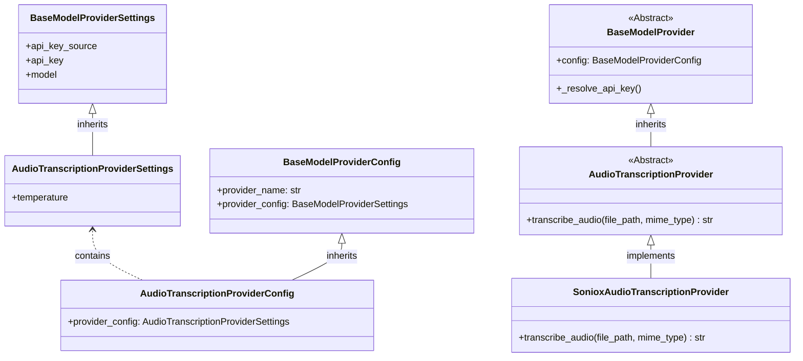

# Feature Specification: Audio Transcription Support

## Overview
- This feature adds automatic audio transcription to `AudioTranscriptionProcessor`.
Every audio file processed by the media processing pipeline which arrives to the `AudioTranscriptionProcessor` will be processed in order to produce a textual representation of the audio content.
- This will be achieved by using a model provider external API (specifically, the Soniox async transcription API).

## Requirements

### Configuration
- `audio_transcription` is added as a new per-bot tier in `LLMConfigurations` (alongside `high`, `low`, `image_moderation`, `image_transcription`), with defaults matching the `low` tier settings (same API-key source), but the configuration should use new dedicated environment variables: `os.getenv("DEFAULT_MODEL_AUDIO_TRANSCRIPTION", "soniox")`, and `float(os.getenv("DEFAULT_AUDIO_TRANSCRIPTION_TEMPERATURE", "0.0"))`. The fallback values `"0.0"` and `"soniox"` must always be specified to prevent startup crashes when the env vars are not set. The default provider module for this tier is `sonioxAudioTranscription`.
- Create a new `AudioTranscriptionProviderSettings` class inheriting from `BaseModelProviderSettings` (because audio transciption lacks chat parameters like explicit reasoning effort flags), adding the `temperature: float = 0.0` field.
- Modify `AudioTranscriptionProviderConfig` to extend `BaseModelProviderConfig` and redefine `provider_config: AudioTranscriptionProviderSettings`. The `LLMConfigurations.audio_transcription` field type is `AudioTranscriptionProviderConfig`.
- `ConfigTier` is updated to include `"audio_transcription"`.
- `resolve_model_config` in `services/resolver.py` returns `AudioTranscriptionProviderConfig` for the `"audio_transcription"` tier.
- `global_configurations.token_menu` is extended with an `"audio_transcription"` pricing entry (as a distinct, independent tier) so audio usage is tracked and priced under the correct tier. The pricing values should be `{input_tokens: 2, cached_input_tokens: 2, output_tokens: 4}` because their prices are now token based, not time based.
- `get_configuration_schema` in `routers/bot_management.py` dynamic tier extraction covers this if implemented using `.keys()`.

### Processing Flow
- The `AudioTranscriptionProcessor` currently resides as a stub in `media_processors/stub_processors.py`. It must be completely refactored. Move it to its own file `media_processors/audio_transcription_processor.py` (and delete the old stub from `stub_processors.py`). Ensure it inherits from `BaseMediaProcessor`.
- Ensure `DEFAULT_POOL_DEFINITIONS` in `services/media_processing_service.py` specifies `"AudioTranscriptionProcessor"` for its relevant mime types (which it already does). 
- `AudioTranscriptionProcessor` will process the file natively and directly (no initial moderation step required, unless dictated otherwise for audio).

### Transcription
- The `AudioTranscriptionProcessor` will use the bot's `audio_transcription` tier to resolve an `AudioTranscriptionProvider` and call `await provider.transcribe_audio(file_path, mime_type)`. The `feature_name` passed to `create_model_provider` for this transcription call must be `"audio_transcription"` (to enable token/duration tracking).
- Transcription response normalization contract:
  - If successful, return the transcribed string by utilizing the Soniox Async API. The flow must precisely be:
    1. Upload the file using `client.files.upload` (or async equivalent).
    2. Start transcription using `client.stt.transcribe(..., file_id=file.id)`.
    3. Wait for completion natively (`client.stt.wait`) and fetch the transcript (`client.stt.get_transcript`).
    4. **Crucial Cleanup:** Wrap the API sequence in a `try/finally` block to guarantee `client.files.delete_if_exists(file.id)` and `client.stt.delete_if_exists(transcription.id)` are executed even if parsing fails or timeouts occur, avoiding Soniox quota exhaustion. (Alternatively, `client.stt.destroy(transcription.id)` can be used to explicitly delete both).
  - If the API returns an empty string or an unexpected format, explicitly track it as a failure. Return `ProcessingResult(content="Unable to transcribe audio content", failed_reason="Unexpected format from Soniox API", unprocessable_media=True)`.
  - **Why this matters:** `unprocessable_media=True` prevents the `"Audio Transcription: "` text injection, while `failed_reason` guarantees the job is inserted into the `_failed` MongoDB collection for operator debugging. The base processor will automatically wrap `"Unable to transcribe audio content"` in brackets, safely append the caption, and successfully deliver the message to the bot queues so the bot can respond.
- **Error handling:** No custom error handling (`try/except`) should be added around `transcribe_audio` within `AudioTranscriptionProcessor`. All exceptions propagate up to `BaseMediaProcessor.process_job()`, which handles failures gracefully and wraps timeouts returning `unprocessable_media=True`.

### Output Format
- The produced audio transcript will be wrapped into a standard `ProcessingResult(content=transcript_text)`.
- Do not add explicit brackets `[` `]` to the output string, as formatting is **centralized** inside `format_processing_result()` from `BaseMediaProcessor` (introduced during image transcription). Returning the raw string is sufficient.

## Relevant Background Information
### Project Files
- `media_processors/stub_processors.py` *(remove `AudioTranscriptionProcessor`)*
- `media_processors/audio_transcription_processor.py` *(new)*
- `media_processors/factory.py`
- `media_processors/__init__.py`
- `model_providers/base.py`
- `model_providers/audio_transcription.py` *(new — abstract `AudioTranscriptionProvider`)*
- `model_providers/sonioxAudioTranscription.py` *(new — concrete `SonioxAudioTranscriptionProvider`)*
- `services/media_processing_service.py`
- `services/model_factory.py`
- `services/resolver.py`
- `routers/bot_management.py`
- `scripts/audioTranslationUpgradeScript.py` *(new single migration script)*
- `config_models.py`

### External Resource
- https://soniox.com/docs/stt/async/async-transcription
- https://soniox.com/docs/stt/async/limits-and-quotas
- https://soniox.com/docs/stt/async/error-handling
- https://soniox.com/docs/stt/SDKs/python-SDK/async-transcription
- https://soniox.com/docs/stt/SDKs/python-SDK/files

## Technical Details

### 1) Provider Architecture
We continue the "Sibling Architecture" for providers.

- `AudioTranscriptionProvider` (in `model_providers/audio_transcription.py`) extends `BaseModelProvider` and declares `async def transcribe_audio(file_path: str, mime_type: str) -> str` as an abstract method. Because Soniox is a pure transcription API and not a standard ChatCompletion model, it does not inherit from `LLMProvider`.
- `SonioxAudioTranscriptionProvider` implements `transcribe_audio` by bypassing LangChain entirely. Use the `AsyncSonioxClient` from the Soniox Python SDK. The `transcribe_audio` method must orchestrate the full async lifecycle (upload -> transcribe -> wait -> get_transcript), strictly ensuring `finally` blocks delete the file and transcription job from the Soniox servers to respect strict file quotas.
- `create_model_provider` return type annotation must be updated to `Union[BaseChatModel, ImageModerationProvider, ImageTranscriptionProvider, AudioTranscriptionProvider]`. Add check for `isinstance(provider, AudioTranscriptionProvider)` if any custom duration tracking must be hooked.

### 2) Deployment Checklist
1. Create a single combined migration script `scripts/audioTranslationUpgradeScript.py` that accomplishes ALL of the following:
   - Updates existing bot configs in MongoDB and adds `config_data.configurations.llm_configs.audio_transcription` where missing.
   - Replaces the existing `token_menu` (which contains only 3 tiers) with a new one containing ALL 4: `high`, `low`, `image_transcription`, `audio_transcription`.
   *(Note: No need for multiple scripts for this spec. If any new need comes up, we will update only this single script).*
2. Extend `DefaultConfigurations` in `config_models.py` with `model_provider_name_audio_transcription = "sonioxAudioTranscription"`.
3. Update `get_bot_defaults` in `routers/bot_management.py` to include `audio_transcription` in `LLMConfigurations` using `AudioTranscriptionProviderConfig` and `DefaultConfigurations`.
4. Define `LLMConfigurations.audio_transcription` as a strictly required field using `Field(...)`.
5. Verification checklist ensures both target collections reflect the schema updates accurately.

### 3) New Configuration Tier Checklist
1. `config_models.py`: Add `"audio_transcription"` to the `ConfigTier` Literal type.
2. `services/resolver.py`: Add the overloaded type `Literal["audio_transcription"]` to `resolve_model_config`.
3. `routers/bot_management.py`: Dynamically extracting schema keys implicitly updates UI constraints.
4. `frontend/src/pages/EditPage.js`: Statically add a fifth entry to the `llm_configs` object in `uiSchema` for `audio_transcription`. The `ui:title` should be `"Audio Transcription Model"`.

### 4) Test Expectations
- Test reading an audio file and yielding transcribed strings in `AudioTranscriptionProcessor`.
- Verify the `asyncio.TimeoutError` exception path correctly applies `unprocessable_media`.
- Verify the final string is returned effectively and formatted through `format_processing_result` properly.
- Update `DEFAULT_POOL_DEFINITIONS` handling logic assertions if `test_media_processing_service.py` contains length-checks for predefined factories.
