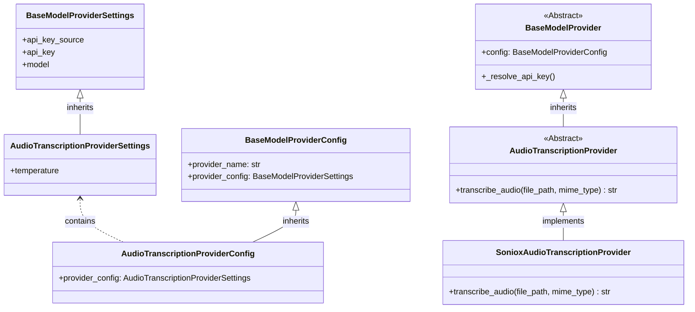

# Feature Specification: Audio Transcription Support

## Overview
- This feature adds automatic audio transcription to `AudioTranscriptionProcessor`.
Every audio file processed by the media processing pipeline which arrives to the `AudioTranscriptionProcessor` will be processed in order to produce a textual representation of the audio content.
- This will be achieved by using a model provider external API (specifically, the Soniox async transcription API).

## Requirements

### Configuration
- `audio_transcription` is added as a new per-bot tier in `LLMConfigurations` (alongside `high`, `low`, `image_moderation`, `image_transcription`), with defaults matching the `low` tier settings (same API-key source), but the configuration should use new dedicated environment variables: `os.getenv("DEFAULT_MODEL_AUDIO_TRANSCRIPTION", "stt-async-v4")`, and `float(os.getenv("DEFAULT_AUDIO_TRANSCRIPTION_TEMPERATURE", "0.0"))`. The fallback values `"0.0"` and `"stt-async-v4"` must always be specified to prevent startup crashes when the env vars are not set. The default provider module for this tier is `sonioxAudioTranscription`.
- Create a new `AudioTranscriptionProviderSettings` class inheriting from `BaseModelProviderSettings` (because audio transciption lacks chat parameters like explicit reasoning effort flags), adding the `temperature: float = 0.0` field. *Note: The `temperature` field is currently a dummy variable specifically ignored by the Soniox provider implementation, kept strictly to ensure future-proofing.*
- Modify `AudioTranscriptionProviderConfig` to extend `BaseModelProviderConfig` and redefine `provider_config: AudioTranscriptionProviderSettings`. The `LLMConfigurations.audio_transcription` field type is `AudioTranscriptionProviderConfig`.
- `ConfigTier` is updated to include `"audio_transcription"`.
- `resolve_model_config` in `services/resolver.py` returns `AudioTranscriptionProviderConfig` for the `"audio_transcription"` tier.
- `global_configurations.token_menu` is extended with an `"audio_transcription"` pricing entry (as a distinct, independent tier) so audio usage is tracked and priced under the correct tier. The exact pricing JSON for this tier must be: `{"input_tokens": 1.5, "output_tokens": 3.5, "cached_input_tokens": 0}`.
- The provider must support a "Callback Injection" pattern where `create_model_provider` creates an async tracking closure (accepting `input_tokens`, `output_tokens`, and `cached_input_tokens`) and injects it into the provider via `set_token_tracker()`. The provider extracts the exact token usage from the SDK and invokes it internally.
- `get_configuration_schema` in `routers/bot_management.py` intentionally utilizes a hardcoded array list for schema tier extraction due to Pydantic `$ref` OpenAPI complexities. (This requires manual list appends in subsequent steps).

### Processing Flow
- The `AudioTranscriptionProcessor` currently resides as a stub in `media_processors/stub_processors.py`. It must be completely refactored. Move it to its own file `media_processors/audio_transcription_processor.py` (and delete the old stub from `stub_processors.py`). Ensure it inherits from `BaseMediaProcessor`.
- Ensure `DEFAULT_POOL_DEFINITIONS` in `services/media_processing_service.py` is expanded to route additional Soniox-supported audio MIME types (including `audio/ogg`, `audio/mpeg`, `audio/wav`, `audio/webm`, `audio/mp4`, `audio/aac`, `audio/flac`, and `audio/amr`) to the `AudioTranscriptionProcessor` to ensure the bot can seamlessly process a wider variety of user audio uploads.
- `AudioTranscriptionProcessor` will process the file natively and directly (no initial moderation step required, unless dictated otherwise for audio).

### Transcription
- The `AudioTranscriptionProcessor` will use the bot's `audio_transcription` tier to resolve an `AudioTranscriptionProvider` and call `await provider.transcribe_audio(file_path, mime_type)`. The `feature_name` passed to `create_model_provider` for this transcription call must be `"audio_transcription"` (to enable token/duration tracking).
- Transcription response normalization contract:
  - If successful, return the transcribed string by utilizing the Soniox Async API. The flow must precisely be:
    1. Start transcription using the explicit 3-step async pattern: (1) `file = await client.files.upload(file_path)`, (2) `transcription = await client.stt.create(config=..., file_id=file.id)`, (3) `await client.stt.wait(transcription.id)`, (4) `transcript = await client.stt.get_transcript(transcription.id)`. The `transcribe()` convenience wrapper **MUST NOT** be used.
    2. Extract usage metrics via `client.stt.get(transcription.id).usage` and invoke the injected token tracking callback.
    3. **Crucial Cleanup:** Wrap the API sequence in a `try/finally` block to guarantee both the transcription job and its associated file are deleted on the Soniox servers (`delete(transcription.id)` and `delete(file.id)`), avoiding quota exhaustion. To prevent resource leaks caused by `asyncio.CancelledError` (which is raised by the base processor's timeout wrapper), wrap the network cleanup commands inside an asynchronous closure, and execute it using `asyncio.create_task(...)` within the `finally` block of the `transcribe_audio` method. This approach creates a fire-and-forget background task attached natively to the event loop, safely bypassing the parent task's `CancelledError` and guaranteeing the remote resources are successfully wiped.
  - If the API returns an empty string or an unexpected format, explicitly track it as a failure. Return `ProcessingResult(content="Unable to transcribe audio content", failed_reason="Unexpected format from Soniox API", unprocessable_media=True)`.
  - **Why this matters:** `unprocessable_media=True` prevents the `"Audio Transcription: "` text injection, while `failed_reason` guarantees the job is inserted into the `_failed` MongoDB collection for operator debugging. The base processor will automatically wrap `"Unable to transcribe audio content"` in brackets, safely append the caption, and successfully deliver the message to the bot queues so the bot can respond.
- **Error handling:** To align with the `ImageVisionProcessor` sibling pattern, `AudioTranscriptionProcessor.process_media` should wrap the `transcribe_audio` call in a `try/except` block. If an exception occurs, catch it and return a structured `ProcessingResult(content="Unable to transcribe audio content", failed_reason=f"Transcription error: {e}")`. This provides operator-friendly error reporting.
  - **Base Processor Global Update**: Update `BaseMediaProcessor.process_job()`'s existing `asyncio.TimeoutError` exception block to explicitly include `unprocessable_media=True` when returning its `ProcessingResult`. This enforces the timeout expectation system-wide.

### Output Format
- The produced audio transcript will be wrapped into a standard `ProcessingResult(content=transcript_text)`.
- Do not add explicit brackets `[` `]` to the output string, as formatting is **centralized** inside `format_processing_result()` from `BaseMediaProcessor` (introduced during image transcription). Returning the raw string is sufficient.
- **Prefix Injection Refactoring**: Refactor `format_processing_result` in `media_processors/base.py` to accept a `mime_type: str` parameter. Inside the formatter, add logic to dynamically capitalize the media type from the mime type (e.g., `"audio"`) and conditionally prepend `"{MediaType} Transcription: "` to the content. This prefix injection must **only** occur if `unprocessable_media` is `False`. Ensure `BaseMediaProcessor.process_job` passes `job.mime_type` to all calls to `format_processing_result`. Furthermore, modify the fallback error handling in `BaseMediaProcessor._handle_unhandled_exception` to explicitly set `unprocessable_media=True` (it currently defaults to False) so that unhandled system errors are correctly flagged as unprocessable media and safely bypass the prefix injection logic. **Note for reviewers:** The injection of the `{MediaType} Transcription:` prefix into `format_processing_result()` is an intentionally global change. It is designed to apply to all successful media processors (e.g., `ImageVisionProcessor` will now output `Image Transcription: ...`). Processors handling corrupt or unsupported media are safely excluded from this prefix because their `unprocessable_media` flag is set to `True`.

## Relevant Background Information
### Project Files
- `media_processors/stub_processors.py` *(remove `AudioTranscriptionProcessor`)*
- `media_processors/audio_transcription_processor.py` *(new)*
- `media_processors/factory.py`
- `media_processors/__init__.py`
- `model_providers/base.py`
- `model_providers/audio_transcription.py` *(new — abstract `AudioTranscriptionProvider`)*
- `model_providers/sonioxAudioTranscription.py` *(new — concrete `SonioxAudioTranscriptionProvider`)*
- `services/media_processing_service.py`
- `services/model_factory.py`
- `services/resolver.py`
- `routers/bot_management.py`
- `scripts/audioTranscriptionUpgradeScript.py` *(new single migration script)*
- `config_models.py`

### External Resource
- https://soniox.com/docs/stt/async/async-transcription
- https://soniox.com/docs/stt/async/limits-and-quotas
- https://soniox.com/docs/stt/async/error-handling
- https://soniox.com/docs/stt/SDKs/python-SDK/async-transcription
- https://soniox.com/docs/stt/SDKs/python-SDK/files

## Technical Details

### 1) Provider Architecture
We continue the "Sibling Architecture" for providers.



- `AudioTranscriptionProvider` (in `model_providers/audio_transcription.py`) extends `BaseModelProvider` and declares `async def transcribe_audio(file_path: str, mime_type: str) -> str` as an abstract method. It must also formally declare an `__init__` constructor that invokes `super().__init__(config)` and subsequently sets `self._token_tracker = None`, as well as an explicit `def set_token_tracker(self, tracker_func):` method. Because Soniox is a pure transcription API and not a standard ChatCompletion model, it does not inherit from `LLMProvider`. Providers must also implement a two-phase initialization pattern via `async def initialize(self):`. 
- `SonioxAudioTranscriptionProvider` implements `transcribe_audio` by bypassing LangChain entirely. Use the `AsyncSonioxClient` from the Soniox Python SDK. The `transcribe_audio` method must orchestrate the full async lifecycle (upload -> transcribe -> wait -> get_transcript), strictly ensuring `finally` blocks delete the file and transcription job from the Soniox servers to respect strict file quotas.
  **Snippet for `SonioxAudioTranscriptionProvider`:**
  *Note: All Soniox SDK calls must use `AsyncSonioxClient`, not the synchronous `SonioxClient`. Each call (`transcribe`, `wait`, `get_transcript`, `get`, `destroy`) must be `await`ed.*
  ```python
  from soniox import AsyncSonioxClient
  from soniox.types import CreateTranscriptionConfig
  
  async def initialize(self):
      self.client = AsyncSonioxClient(api_key=self._resolve_api_key())

  async def transcribe_audio(self, audio_path: str, mime_type: str) -> str:
      transcription = None
      file = None
      try:
          file = await self.client.files.upload(audio_path)
          config = CreateTranscriptionConfig(model=self.config.provider_config.model)
          transcription = await self.client.stt.create(config=config, file_id=file.id)
          
          await self.client.stt.wait(transcription.id)
          
          if self._token_tracker:
              job_info = await self.client.stt.get(transcription.id)
              if job_info and job_info.usage:
                  await self._token_tracker(
                      input_tokens=job_info.usage.input_audio_tokens,
                      output_tokens=job_info.usage.output_text_tokens,
                      cached_input_tokens=0
                  )
                  
          transcript = await self.client.stt.get_transcript(transcription.id)
          return transcript.text
          
      finally:
          async def _cleanup():
              if transcription:
                  try: await self.client.stt.delete(transcription.id)
                  except Exception: pass
              if file:
                  try: await self.client.files.delete(file.id)
                  except Exception: pass
          asyncio.create_task(_cleanup())
  ```
- `create_model_provider` return type annotation must be updated to `Union[BaseChatModel, ImageModerationProvider, ImageTranscriptionProvider, AudioTranscriptionProvider]`.
  - **Refactor Initialization**: Extract the instantiation of `TokenConsumptionService` and its required `get_global_state()` dictionary fetch out of the `if isinstance(provider, LLMProvider):` tracking block. It must be initialized universally *before* the type checks so that it is accessible to all provider branches.
  - Add an explicit `elif isinstance(provider, AudioTranscriptionProvider): return provider` branch to bypass LangChain mechanisms without throwing a TypeError. Inside this new branch, inject the tracking closure using the globally available `token_service`.
  - Also ensure that all providers call an `await provider.initialize()` step immediately after instantiation inside `create_model_provider` to ensure their external HTTP clients are started (this also applies to fixing the `ImageModerationProvider` which currently creates clients dynamically on every request). *Note: The provider instances intentionally omit a teardown/close call as a known leaky capability limit, since later a provider caching layer inside the factory will effectively cap the maximum active connections to the active bot volume.* Instruct the developer to add a no-op `async def initialize(self): pass` method explicitly to the abstract `BaseModelProvider` base class in `model_providers/base.py`. Emphasize that it should *not* be marked as `@abstractmethod`, ensuring existing providers safely inherit the empty method to prevent factory instantiation crashes, while allowing the new `SonioxAudioTranscriptionProvider` to cleanly override it.
  **Snippet for `model_factory.py`:**
  ```python
  async def token_tracker(input_tokens: int, output_tokens: int, cached_input_tokens: int = 0):
      await token_service.record_event(
          user_id=user_id,
          bot_id=bot_id,
          feature_name=feature_name,
          input_tokens=input_tokens,
          output_tokens=output_tokens,
          cached_input_tokens=cached_input_tokens,
          config_tier=config_tier
      )
  
  provider.set_token_tracker(token_tracker)
  ```

### 2) Deployment Checklist
1. Create a single combined migration script `scripts/audioTranscriptionUpgradeScript.py` that accomplishes ALL of the following:
   - Updates existing bot configs in MongoDB and adds `config_data.configurations.llm_configs.audio_transcription` where missing.
   - Replaces the existing `token_menu` (which contains only 3 tiers) with a new one containing ALL 4: `high`, `low`, `image_transcription`, `audio_transcription`. The new `audio_transcription` tier must explicitly use the exact JSON pricing dictionary: `{"input_tokens": 1.5, "output_tokens": 3.5, "cached_input_tokens": 0}`.
   *(Note: No need for multiple scripts for this spec. If any new need comes up, we will update only this single script).*
2. Extend `DefaultConfigurations` in `config_models.py` with `model_provider_name_audio_transcription = "sonioxAudioTranscription"`, and explicitly add `model_audio_transcription: str = os.getenv("DEFAULT_MODEL_AUDIO_TRANSCRIPTION", "stt-async-v4")` and `model_audio_transcription_temperature: float = float(os.getenv("DEFAULT_AUDIO_TRANSCRIPTION_TEMPERATURE", "0.0"))` inside the class.
3. Update `get_bot_defaults` in `routers/bot_management.py` to include `audio_transcription` in `LLMConfigurations` using `AudioTranscriptionProviderConfig` and `DefaultConfigurations`.
4. Define `LLMConfigurations.audio_transcription` as a strictly required field using `Field(...)`.
5. Verification checklist ensures both target collections reflect the schema updates accurately.
6. Update the import of `AudioTranscriptionProcessor` in `media_processors/factory.py` to point to `media_processors.audio_transcription_processor` instead of `stub_processors`.

### 3) New Configuration Tier Checklist
1. `config_models.py`: Add `"audio_transcription"` to the `ConfigTier` Literal type.
2. `services/resolver.py`: Add the overloaded type `Literal["audio_transcription"]` to `resolve_model_config`, and refactor the functional python body away from hardcoded if/elif statements, instead using a dynamic dictionary-based registry mapping `ConfigTier` to Pydantic Models with `.get(config_tier, ChatCompletionProviderConfig)`.
3. `routers/bot_management.py`: Dynamically extracting schema keys implicitly updates UI constraints, but you MUST also manually append `"audio_transcription"` to the hardcoded tier fallback list around line 365.
4. `frontend/src/pages/EditPage.js`: Statically add a fifth entry to the `llm_configs` object in `uiSchema` for `audio_transcription`. The `ui:title` should be `"Audio Transcription Model"`. Ensure this configuration deliberately omits the `reasoning_effort` and `seed` sub-entries, as this provider is not a Chat Completion provider.
5. `frontend/src/pages/EditPage.js`: Manually append `"audio_transcription"` to the two hardcoded tier arrays inside the `handleFormChange` loops for validation, as well as the third array located inside the `useEffect` data fetching block around line 135.

### 4) Test Expectations
- Test reading an audio file and yielding transcribed strings in `AudioTranscriptionProcessor`.
- Verify the `asyncio.TimeoutError` exception path correctly applies `unprocessable_media`.
- Verify the final string is returned effectively and formatted through `format_processing_result` properly.
- Update `DEFAULT_POOL_DEFINITIONS` handling logic assertions if `test_media_processing_service.py` contains length-checks for predefined factories.
