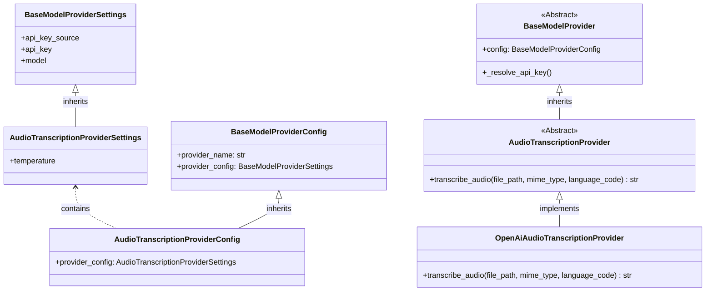

# Feature Specification: Audio Transcription Support

## Overview
- This feature adds automatic audio transcription to `AudioTranscriptionProcessor`.
Every audio file processed by the media processing pipeline which arrives to the `AudioTranscriptionProcessor` will be processed in order to produce a textual representation of the audio content.
- This will be achieved by using a model provider external API.

## Requirements

### Configuration
- `audio_transcription` is added as a new per-bot tier in `LLMConfigurations` (alongside `high`, `low`, `image_moderation`, `image_transcription`), with defaults matching the `low` tier settings (same API-key source), but the configuration should use new dedicated environment variables: `os.getenv("DEFAULT_MODEL_AUDIO_TRANSCRIPTION", "whisper-1")`, and `float(os.getenv("DEFAULT_AUDIO_TRANSCRIPTION_TEMPERATURE", "0.0"))`. The fallback values `"0.0"` and `"whisper-1"` must always be specified to prevent startup crashes when the env vars are not set. The default provider module for this tier is `openAiAudioTranscription`.
- Create a new `AudioTranscriptionProviderSettings` class inheriting from `BaseModelProviderSettings` (because audio transciption lacks chat parameters like explicit reasoning effort flags), adding the `temperature: float = 0.0` field.
- Modify `AudioTranscriptionProviderConfig` to extend `BaseModelProviderConfig` and redefine `provider_config: AudioTranscriptionProviderSettings`. The `LLMConfigurations.audio_transcription` field type is `AudioTranscriptionProviderConfig`.
- `ConfigTier` is updated to include `"audio_transcription"`.
- `resolve_model_config` in `services/resolver.py` returns `AudioTranscriptionProviderConfig` for the `"audio_transcription"` tier.
- Reuse the existing `resolve_bot_language(bot_id: str) -> str` inside `services/resolver.py` that fetches the `language_code` to inject into the audio prompt payload.
- `global_configurations.token_menu` is extended with an `"audio_transcription"` pricing entry (as a distinct, independent tier) so audio usage is tracked and priced under the correct tier. The pricing values can be equivalent mapped rates suitable for the typical whisper pricing, e.g. mapping internal token units to duration cost (such as `input_tokens: 0.006`, `cached_input_tokens: 0.025`, `output_tokens: 0.0`), explicitly noting that cost is purely based on duration matching the logic implemented in the provider.
- `get_configuration_schema` in `routers/bot_management.py` dynamic tier extraction covers this if implemented using `.keys()`.

### Processing Flow
- The `AudioTranscriptionProcessor` currently resides as a stub in `media_processors/stub_processors.py`. It must be completely refactored. Move it to its own file `media_processors/audio_transcription_processor.py` (and delete the old stub from `stub_processors.py`). Ensure it inherits from `BaseMediaProcessor`.
- Ensure `DEFAULT_POOL_DEFINITIONS` in `services/media_processing_service.py` specifies `"AudioTranscriptionProcessor"` for its relevant mime types (which it already does). 
- `AudioTranscriptionProcessor` will process the file natively and directly (no initial moderation step required, unless dictated otherwise for audio).

### Transcription
- `AudioTranscriptionProcessor` will explicitly retrieve the bot's configured language by calling `resolve_bot_language(bot_id)`.
- It will then use the bot's `audio_transcription` tier to resolve an `AudioTranscriptionProvider` and call `await provider.transcribe_audio(file_path, mime_type, language_code)`. The `feature_name` passed to `create_model_provider` for this transcription call must be `"audio_transcription"` (to enable token/duration tracking).
- Transcription response normalization contract:
  - If successful, return the transcribed string.
  - If processing fails internally returning None or unexpected format: return `"Unable to transcribe audio content"`.
- **Error handling:** No custom error handling (`try/except`) should be added around `transcribe_audio` within `AudioTranscriptionProcessor`. All exceptions propagate up to `BaseMediaProcessor.process_job()`, which handles failures gracefully and wraps timeouts returning `unprocessable_media=True`.

### Output Format
- The produced audio transcript will be wrapped into a standard `ProcessingResult(content=transcript_text)`.
- Do not add explicit brackets `[` `]` to the output string, as formatting is **centralized** inside `format_processing_result()` from `BaseMediaProcessor` (introduced during image transcription). Returning the raw string is sufficient.

## Relevant Background Information
### Project Files
- `media_processors/stub_processors.py` *(remove `AudioTranscriptionProcessor`)*
- `media_processors/audio_transcription_processor.py` *(new)*
- `media_processors/factory.py`
- `media_processors/__init__.py`
- `model_providers/base.py`
- `model_providers/audio_transcription.py` *(new — abstract `AudioTranscriptionProvider`)*
- `model_providers/openAiAudioTranscription.py` *(new — concrete `OpenAiAudioTranscriptionProvider`)*
- `services/media_processing_service.py`
- `services/model_factory.py`
- `services/resolver.py`
- `routers/bot_management.py`
- `scripts/migrations/migrate_audio_transcription.py` *(new)*
- `scripts/migrations/initialize_quota_and_bots.py` *(update for audio_transcription token menu tier)*
- `scripts/migrations/migrate_token_menu_audio_transcription.py` *(new)*
- `config_models.py`

## Technical Details

### 1) Provider Architecture
We continue the "Sibling Architecture" for providers.

- `AudioTranscriptionProvider` (in `model_providers/audio_transcription.py`) extends `BaseModelProvider` and declares `async def transcribe_audio(file_path: str, mime_type: str, language_code: str) -> str` as an abstract method. Because whisper is not a standard chat completion model, it does not inherit from `LLMProvider`.
- `OpenAiAudioTranscriptionProvider` implements `transcribe_audio` by bypassing LangChain entirely. Use standard `AsyncOpenAI` client directly, initializing it inside the constructor `__init__` with the resolved API key.
- `create_model_provider` return type annotation must be updated to `Union[BaseChatModel, ImageModerationProvider, ImageTranscriptionProvider, AudioTranscriptionProvider]`. Add check for `isinstance(provider, AudioTranscriptionProvider)` if any custom duration tracking must be hooked.

### 2) Deployment Checklist
1. Add migration script `scripts/migrations/migrate_audio_transcription.py` to iterate existing bot configs in MongoDB and add `config_data.configurations.llm_configs.audio_transcription` where missing.
2. Extend `DefaultConfigurations` in `config_models.py` with `model_provider_name_audio_transcription = "openAiAudioTranscription"`.
3. Update `get_bot_defaults` in `routers/bot_management.py` to include `audio_transcription` in `LLMConfigurations` using `AudioTranscriptionProviderConfig` and `DefaultConfigurations`.
4. Define `LLMConfigurations.audio_transcription` as a strictly required field using `Field(...)`.
5. Update `scripts/migrations/initialize_quota_and_bots.py` to include the `audio_transcription` tier in the `token_menu` dictionary, bringing the total to 4 pricing tiers (`high`, `low`, `image_transcription`, `audio_transcription`).
6. Create `scripts/migrations/migrate_token_menu_audio_transcription.py` to patch existing environments using the same 4-tier menu by wiping the old document and replacing it.
7. Verification checklist ensures both target collections reflect the schema updates accurately.

### 3) New Configuration Tier Checklist
1. `config_models.py`: Add `"audio_transcription"` to the `ConfigTier` Literal type.
2. `services/resolver.py`: Add the overloaded type `Literal["audio_transcription"]` to `resolve_model_config`.
3. `routers/bot_management.py`: Dynamically extracting schema keys implicitly updates UI constraints.
4. `frontend/src/pages/EditPage.js`: Statically add a fifth entry to the `llm_configs` object in `uiSchema` for `audio_transcription`. The `ui:title` should be `"Audio Transcription Model"`.

### 4) Test Expectations
- Test reading an audio file and yielding transcribed strings in `AudioTranscriptionProcessor`.
- Verify the `asyncio.TimeoutError` exception path correctly applies `unprocessable_media`.
- Verify the final string is returned effectively and formatted through `format_processing_result` properly.
- Update `DEFAULT_POOL_DEFINITIONS` handling logic assertions if `test_media_processing_service.py` contains length-checks for predefined factories.
