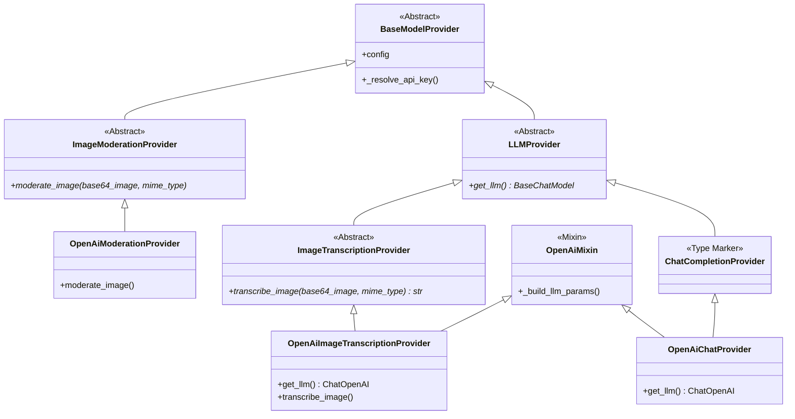

# Spec Review: Image Transcript Support (08_ag_opus_4_6_strictMode)

## Summary Table

| Priority | ID | Title | Link | Status |
| :--- | :--- | :--- | :--- | :--- |
| P0 | ARCH_01 | `get_llm()` idempotency contract not satisfied by existing `OpenAiChatProvider` | [#arch_01](#arch_01) | READY |
| P0 | ARCH_02 | `BaseMediaProcessor.process_job` has no access to `caption` — cannot centralize caption formatting | [#arch_02](#arch_02) | READY |
| P1 | ARCH_03 | Return type of `create_model_provider` becomes a three-way union — callers lose type safety | [#arch_03](#arch_03) | READY |
| P1 | GAP_01 | `LLMProvider` insertion into hierarchy is a breaking refactor of `ChatCompletionProvider` | [#gap_01](#gap_01) | READY |
| P1 | GAP_02 | `OpenAiMixin` extraction scope and `_resolve_api_key` ownership is underspecified | [#gap_02](#gap_02) | READY |
| P1 | GAP_03 | `ImageTranscriptionProviderConfig.detail` field must be excluded from `_build_llm_params` but spec doesn't specify how | [#gap_03](#gap_03) | READY |
| P2 | ISSUE_02 | Hardcoded tier lists in `EditPage.js` at two locations — spec only addresses one | [#issue_02](#issue_02) | READY |
| P2 | ISSUE_03 | `bot_management.py` schema surgery uses hardcoded list — needs dynamic iteration | [#issue_03](#issue_03) | READY |
| P2 | ISSUE_04 | `initialize_quota_and_bots.py` token menu does not include the new `image_transcription` tier | [#issue_04](#issue_04) | READY |
| P2 | GAP_04 | `ImageVisionProcessor.process_media` currently passes `"media_processing"` as `feature_name` — must change to `"image_transcription"` | [#gap_04](#gap_04) | READY |
| P3 | GAP_05 | Moderation flagging output format uses Python-style tuple string — fragile format specification | [#gap_05](#gap_05) | READY |
| P3 | GAP_06 | `uiSchema` in `EditPage.js` requires entry for the new `image_transcription` tier | [#gap_06](#gap_06) | READY |
| P3 | LINT_01 | Spec references `gpt-5-mini` for default model but `DefaultConfigurations` already uses env var `DEFAULT_MODEL_LOW` | [#lint_01](#lint_01) | READY |
| P3 | LINT_02 | `"original"` detail level only works with `gpt-5.4` — spec acknowledges but no validation or documentation guard | [#lint_02](#lint_02) | READY |

---

## Detailed Findings


<a id="arch_01"></a>
### [P0] ARCH_01: `get_llm()` idempotency contract not satisfied by existing `OpenAiChatProvider`
**Title:** `get_llm()` idempotency contract not satisfied by existing `OpenAiChatProvider`
**Detailed Description:**
The spec (Section 1, paragraph on "Callback continuity") mandates a **strict contract**: `get_llm()` must be idempotent and return the **same in-memory `ChatOpenAI` instance** for the provider's lifetime. This guarantees the `TokenTrackingCallback` attached by `create_model_provider` in `model_factory.py` (line 48) is present on the exact LLM object later used by `transcribe_image`.

However, the existing `OpenAiChatProvider.get_llm()` (`model_providers/openAi.py`, line 41-56) creates a **new** `ChatOpenAI` instance on every call:
```python
def get_llm(self):
    llm_params = self._build_llm_params()
    llm = ChatOpenAI(**llm_params)
    return llm
```

If `OpenAiImageTranscriptionProvider` inherits similar behavior (or shares `OpenAiMixin` logic), then the factory attaches the callback to instance A, but `transcribe_image` calls `get_llm()` again and gets instance B — **without the callback**. Token tracking silently breaks.

The spec states the requirement but does not specify the implementation mechanism. The fix must also be applied to `OpenAiChatProvider` for consistency, or at least to `OpenAiImageTranscriptionProvider`. A common pattern is lazy initialization with a cached `_llm` attribute.
**Status:** READY
**Required Actions:**
1. Use constructor-time initialization: create the `ChatOpenAI` instance inside `__init__` and store it as `self._llm`. Make `get_llm()` simply return `self._llm`.
2. Apply this pattern to both `OpenAiChatProvider` (refactor existing) and `OpenAiImageTranscriptionProvider` (new code).
3. This guarantees the `TokenTrackingCallback` attached by the factory in `create_model_provider` is always on the same object used by `transcribe_image()`.


<a id="arch_02"></a>
### [P0] ARCH_02: `BaseMediaProcessor.process_job` has no access to `caption` — cannot centralize caption formatting
**Title:** `BaseMediaProcessor.process_job` has no access to `caption` — cannot centralize caption formatting
**Detailed Description:**
The spec (Section "Output Format", lines 35-47) states that `BaseMediaProcessor.process_job` and `_handle_unhandled_exception` will handle final result formatting and caption concatenation **centrally** for all media processors. However, examining `BaseMediaProcessor.process_job` (`media_processors/base.py`, line 22-77):

```python
async def process_job(self, job: MediaProcessingJob, get_bot_queues, db):
```

The `MediaProcessingJob` dataclass (`infrastructure/models.py`, line 8-19) contains `placeholder_message: Message`, and the `Message` dataclass (`queue_manager.py`, line 29-39) stores `content` — which is the placeholder text, **not** the original WhatsApp caption.

The `caption` is passed to `process_media(file_path, mime_type, caption, bot_id)` as a parameter (line 29 of `base.py`), where `caption` is `job.placeholder_message.content`. But `placeholder_message.content` is the **placeholder text** (e.g., `"⏳ Processing image..."`), not the user's original caption from the WhatsApp message.

Inspecting `queue_manager.py` `add_message` (line 155-208), the `content` passed for media messages is the placeholder content. The actual WhatsApp image caption is used as `content` in the placeholder message — so `job.placeholder_message.content` actually **is** the caption text.

However, there is a timing issue: `process_job` calls `process_media` passing `job.placeholder_message.content` as `caption`. But the spec says `process_job` should also append the caption to the **result** after `process_media` returns. This means `process_job` needs to:
1. Store the caption from `job.placeholder_message.content` before calling `process_media`
2. After `process_media` returns, append the caption formatting

The spec does not clarify whether `process_media` returning `ProcessingResult.content` should already include `[Attached image description: ...]` wrapper, or whether `process_job` wraps it. Since the spec says "base media processor handles the final result formatting", it implies `process_media` returns only the raw transcription text, and `process_job` wraps it. But this would break **all other processors** (audio, video, document, corrupt, unsupported) which currently return fully-formatted content from `process_media`.

This is a fundamental design tension that needs resolution: either the caption formatting is processor-specific (each `process_media` does it), or it's centralized (but then all other processors must change their `ProcessingResult.content` semantics).
**Status:** READY
**Required Actions:**
1. Caption formatting is **processor-specific**: `ImageVisionProcessor.process_media` returns the fully-formatted output including `[Attached image description: <transcription>]` and `[Image caption: <caption>]` (when caption exists). `BaseMediaProcessor.process_job` is **not** modified for caption logic.
2. However, `BaseMediaProcessor._handle_unhandled_exception` **must** be updated: it currently returns `ProcessingResult(content="[Media processing failed]", ...)`. Change it to append `\n[Image caption: <caption>]` to the content **only if** the original caption (from `job.placeholder_message.content`) is non-empty. This ensures captions are preserved even in crash scenarios.
3. The spec's statement about "base media processor handles final result formatting centrally" is narrowed to only the failure path. The success path remains processor-specific.


<a id="arch_03"></a>
### [P1] ARCH_03: Return type of `create_model_provider` becomes a three-way union — callers lose type safety
**Title:** Return type of `create_model_provider` becomes a three-way union — callers lose type safety
**Detailed Description:**
`create_model_provider` in `services/model_factory.py` (line 23) currently returns `Union[BaseChatModel, ImageModerationProvider]`. With the addition of `ImageTranscriptionProvider`, it becomes `Union[BaseChatModel, ImageModerationProvider, ImageTranscriptionProvider]`.

The spec says: "For the `ImageTranscriptionProvider` subtype specifically, the factory returns the provider object (not raw LLM)." This means the return type is becoming increasingly polymorphic.

The current caller `ImageVisionProcessor` (line 22) already does a manual `isinstance` check after receiving the result. The new transcription call will also need to import `ImageTranscriptionProvider` and check `isinstance`. This is workable but:
1. The function signature's return type annotation is misleading — `BaseChatModel` is not even a provider type, mixing abstractions
2. Every new provider sibling type widens the union further

This is not blocking but represents growing technical debt. The spec should consider whether `create_model_provider` should consistently return providers (not raw LLMs for chat), or at minimum document the return type contract clearly in the docstring.
**Status:** READY
**Required Actions:**
1. Add `ImageTranscriptionProvider` to the `Union` return type annotation of `create_model_provider`.
2. Update the docstring to clearly document the return contract: `ChatCompletionProvider` → returns raw `BaseChatModel` with callback attached; `ImageModerationProvider` → returns provider directly; `ImageTranscriptionProvider` → returns provider directly (caller accesses LLM via `transcribe_image`).
3. Accept this as known technical debt — the sibling architecture inherently requires `isinstance` checks by callers regardless of return type.


<a id="gap_01"></a>
### [P1] GAP_01: `LLMProvider` insertion into hierarchy is a breaking refactor of `ChatCompletionProvider`
**Title:** `LLMProvider` insertion into hierarchy is a breaking refactor of `ChatCompletionProvider`
**Detailed Description:**
The spec (Section 1, line 105) states: "Define a new abstract base class `LLMProvider` in `model_providers/base.py` that inherits from `BaseModelProvider` and declares the abstract `get_llm()` method. **Modify `ChatCompletionProvider` to inherit from `LLMProvider` instead of `BaseModelProvider`.**"

Currently `ChatCompletionProvider` (`model_providers/chat_completion.py`, lines 6-9):
```python
class ChatCompletionProvider(BaseModelProvider):
    @abstractmethod
    def get_llm(self) -> BaseChatModel:
        pass
```

The refactoring requires:
1. Moving `get_llm()` from `ChatCompletionProvider` to the new `LLMProvider`
2. Changing `ChatCompletionProvider` to inherit from `LLMProvider`

This is straightforward but has a subtlety: `ChatCompletionProvider` currently only declares `get_llm()`. After refactoring, it becomes an empty class that just inherits from `LLMProvider`. The spec's mermaid diagram (line 92) shows `ChatCompletionProvider` should also declare `invoke_chat(messages)*`, but **this method does not exist anywhere in the codebase**. No existing code calls `invoke_chat` — all callers use `get_llm()` directly.

The spec introduces `invoke_chat` in the mermaid diagram but never references it again. This is a contradiction — either the diagram is aspirational/incorrect, or the spec is missing a requirement for `ChatCompletionProvider` to add an `invoke_chat` abstract method.
**Status:** READY
**Required Actions:**
1. Insert `LLMProvider` with `get_llm()` as specified. Make `ChatCompletionProvider` inherit from `LLMProvider` and become an empty type-marker class. Ignore `invoke_chat` from the spec's mermaid diagram — it is a diagram error (not referenced anywhere in spec text or codebase).
2. Refactor `create_model_provider` to use a unified `isinstance(provider, LLMProvider)` branch for token tracking, with only the return value differing per subtype.
3. The corrected class hierarchy:



4. The corrected factory flow:

```
┌─────────────────────────────────────────────┐
│         create_model_provider()             │
│                                             │
│  1. resolve config + load provider          │
│                                             │
│  2. isinstance(provider, LLMProvider)?      │
│     │                                       │
│     YES → llm = provider.get_llm()          │
│           attach TokenTrackingCallback(llm) │
│           │                                 │
│           isinstance(ChatCompletionProvider)│
│             YES → return llm (raw)          │
│             NO  → return provider (wrapper) │
│                                             │
│     NO → isinstance(ImageModerationProvider)│
│            YES → return provider            │
│                  (no LLM, no token tracking)│
└─────────────────────────────────────────────┘
```


<a id="gap_02"></a>
### [P1] GAP_02: `OpenAiMixin` extraction scope and `_resolve_api_key` ownership is underspecified
**Title:** `OpenAiMixin` extraction scope and `_resolve_api_key` ownership is underspecified
**Detailed Description:**
The spec (Section 1, lines 107-108) states: "Define a centralized `OpenAiMixin` containing the shared OpenAI initialization logic (`_resolve_base_url`, kwargs filtering, API key handling). `OpenAiChatProvider` must be refactored to use this same `OpenAiMixin`."

Looking at the existing `OpenAiChatProvider` (`model_providers/openAi.py`), the shared logic includes:
1. `_build_llm_params()` (lines 12-39): model_dump, pop custom fields, resolve API key, filter None values
2. `get_llm()` (lines 41-56): build params, create `ChatOpenAI`, setup httpx logger

However, `_resolve_api_key()` is defined in `BaseModelProvider` (`model_providers/base.py`, line 10-17), not in `OpenAiChatProvider`. The spec mentions `_resolve_base_url` but this method **does not exist** anywhere in the codebase. This appears to be a reference to a feature not yet implemented or a naming error.

The spec needs to clarify:
1. What exactly goes into `OpenAiMixin` vs. stays in `BaseModelProvider`?
2. Does `_resolve_api_key` stay in `BaseModelProvider` (it's provider-agnostic) or move to `OpenAiMixin`?
3. Does `_build_llm_params` move to `OpenAiMixin`?
4. Where does `_resolve_base_url` come from — is this a new method to be added?
5. Python mixins don't have `__init__` easily — how do `OpenAiChatProvider.__init__` and `OpenAiImageTranscriptionProvider.__init__` share initialization via the mixin?
**Status:** READY
**Required Actions:**
1. `OpenAiMixin` contains only `_build_llm_params()` — the shared kwargs building logic: `model_dump()` → pop common custom fields (`api_key_source`, `record_llm_interactions`) → resolve API key → filter None-valued optional fields (`reasoning_effort`, `seed`). This is the code currently in `OpenAiChatProvider._build_llm_params()`.
2. `_resolve_api_key()` stays in `BaseModelProvider` — it's provider-agnostic (used by `OpenAiModerationProvider` too).
3. `_resolve_base_url` from the spec is a naming error — ignore it, it doesn't exist.
4. Each subclass is responsible for popping its own extra fields **before** passing kwargs to `ChatOpenAI(...)`. Specifically: `OpenAiImageTranscriptionProvider` must pop `detail` from the params returned by `_build_llm_params()`, store it for use in `transcribe_image()`, and pass the remaining params to `ChatOpenAI`. `OpenAiChatProvider` has no extra fields to pop beyond what the mixin already handles.
5. Both concrete classes call `self._build_llm_params()` in their `__init__` to create+store the `ChatOpenAI` instance (as decided in ARCH_01).


<a id="gap_03"></a>
### [P1] GAP_03: `ImageTranscriptionProviderConfig.detail` field must be excluded from `_build_llm_params` but spec doesn't specify how
**Title:** `ImageTranscriptionProviderConfig.detail` field must be excluded from `_build_llm_params` but spec doesn't specify how
**Detailed Description:**
The spec (Section 2, line 127) states: "`detail` is transcription-only metadata and **must never be forwarded into `ChatOpenAI(...)` constructor kwargs**; it is used only when building the multimodal image payload."

Currently, `OpenAiChatProvider._build_llm_params()` (`model_providers/openAi.py`, line 12-39) does a `model_dump()` of the provider config and then pops specific fields. For `ImageTranscriptionProviderConfig`, the `detail` field would need to be popped as well.

If `OpenAiMixin` centralizes `_build_llm_params`, it needs to be aware of all fields that might exist across different config types (`ChatCompletionProviderSettings` has `reasoning_effort`, `seed`, `record_llm_interactions`; `ImageTranscriptionProviderConfig` would add `detail`). The mixin either:
1. Pops a hardcoded list of known custom fields (fragile — new fields require updating the list)
2. Uses allowlisting instead (only passes known `ChatOpenAI` kwargs)
3. Each subclass overrides `_build_llm_params` and calls `super()` + additional pops

The spec says `detail` must be filtered but does not prescribe which approach to use. Given this is a test requirement too (Section 5, line 157: "Add tests that verify `detail` is filtered from `ChatOpenAI(...)` constructor kwargs"), the mechanism needs to be clearly defined.
**Status:** READY
**Required Actions:**
1. Subclass pops `detail` after calling mixin's `_build_llm_params()`: in `OpenAiImageTranscriptionProvider.__init__`, call `params = self._build_llm_params()`, then `self._detail = params.pop("detail", "auto")`, then `self._llm = ChatOpenAI(**params)`.
2. `OpenAiChatProvider` has no extra fields to pop — it calls `_build_llm_params()` and passes directly to `ChatOpenAI`.
3. `self._detail` is then used only when constructing the multimodal `image_url` payload inside `transcribe_image()`.
4. Tests must verify `detail` is not present in `ChatOpenAI(...)` constructor kwargs (existing spec test requirement in Section 5).


<a id="issue_02"></a>
### [P2] ISSUE_02: Hardcoded tier lists in `EditPage.js` at two locations — spec only addresses one
**Title:** Hardcoded tier lists in `EditPage.js` at two locations — spec only addresses one
**Detailed Description:**
The spec (Section 4, line 148-153) correctly identifies that `EditPage.js` must not hardcode tier lists and provides a solution using `Object.keys(schemaData.properties.configurations.properties.llm_configs.properties)`.

However, `EditPage.js` has **two** separate hardcoded tier iteration points:

1. **Line 135**: In the data-loading useEffect — normalizing `api_key_source`:
   ```javascript
   ['high', 'low', 'image_moderation'].forEach(type => {
   ```

2. **Line 229**: In `handleFormChange` — managing `api_key` and `reasoning_effort`:
   ```javascript
   ['high', 'low', 'image_moderation'].forEach(type => {
   ```

Additionally, the **`uiSchema`** object (lines 420-458) has hardcoded entries for `high`, `low`, and `image_moderation` with specific UI templates and labels. A new `image_transcription` tier would need a corresponding `uiSchema` entry or it would render with default (unstyled) form UI. The spec does not mention this.

The spec's proposed fix (`Object.keys(schemaData...)`) would work for the iteration loops but not for the `uiSchema` structure which requires per-tier configuration.
**Status:** READY
**Required Actions:**
1. Extract a shared helper function in `EditPage.js`: `const getAvailableTiers = (schemaData) => Object.keys(schemaData?.properties?.configurations?.properties?.llm_configs?.properties || {});`.
2. Update **both** hardcoded loops (line 135 and line 229) to use this dynamic helper to iterate over the available tiers from the parsed API response schema.
3. This ensures any new tier added by the backend is automatically processed by both the data-loading normalization and the form change handlers.


<a id="issue_03"></a>
### [P2] ISSUE_03: `bot_management.py` schema surgery uses hardcoded list — needs dynamic iteration
**Title:** `bot_management.py` schema surgery uses hardcoded list — needs dynamic iteration
**Detailed Description:**
In `routers/bot_management.py` (line 364):
```python
for prop_name in ['high', 'low', 'image_moderation']:
```

The spec (Section 4, line 147) requires this to use `get_args(ConfigTier)` or `LLMConfigurations.model_fields.keys()` for dynamic iteration. This was also identified in the prior review #07 (ISSUE_02). The spec correctly calls this out — confirming it's a real issue that needs fixing.

Additionally, the `config_models.py` `LLMConfigurations` model (line 98-101) currently has three fields. Adding `image_transcription` means `LLMConfigurations.model_fields.keys()` would be the more reliable source of truth than `get_args(ConfigTier)`, since `ConfigTier` is a Literal type and `LLMConfigurations` is the actual model. The spec mentions both options — the implementation should settle on one canonical source.
**Status:** READY
**Required Actions:**
1. Update `routers/bot_management.py` to iterate using `LLMConfigurations.model_fields.keys()` instead of the hardcoded `['high', 'low', 'image_moderation']` list.
2. This establishes `LLMConfigurations` as the single canonical source of truth for available config tiers, guaranteeing that the frontend schema perfectly matches the backend data model.


<a id="issue_04"></a>
### [P2] ISSUE_04: `initialize_quota_and_bots.py` token menu does not include the new `image_transcription` tier
**Title:** `initialize_quota_and_bots.py` token menu does not include the new `image_transcription` tier
**Detailed Description:**
The existing `scripts/migrations/initialize_quota_and_bots.py` (lines 50-61) initializes the token menu with only `high` and `low` tiers:
```python
token_menu = {
    "high": { ... },
    "low": { ... }
}
```

The spec (Section 3, line 70) says this file should be updated to include `image_transcription`. However, the existing script uses a check-and-insert pattern (line 64-69):
```python
existing_menu = await global_config_collection.find_one({"_id": "token_menu"})
if not existing_menu:
    await global_config_collection.insert_one(...)
```

This means if the token_menu already exists (which it will in any non-fresh deployment), the script **silently skips** the update. Simply adding `image_transcription` to this script's `token_menu` dict won't retroactively patch existing deployments — that's handled by the separate migration script `migrate_token_menu_image_transcription.py`.

The spec correctly calls for both files. However, the update to `initialize_quota_and_bots.py` should also consider changing the insert logic to `upsert=True` for idempotency, or at least merging the new tier into an existing menu document rather than skipping entirely.
**Status:** PENDING
**Status:** READY
**Required Actions:**
1. **Self-healing startup logic:** Update `QuotaService.load_token_menu()` (`services/quota_service.py`, line ~34) to no longer just log an error if `token_menu` is missing. Instead, if it's missing, it should automatically insert a default `token_menu` document (including `high`, `low`, and the new `image_transcription` pricing entries) into the global config collection and then load it.
2. **Destructive migration script:** Update the spec's `scripts/migrations/migrate_token_menu_image_transcription.py` requirement. The script should completely delete any existing `token_menu` document and re-insert the full correct menu from scratch (including `image_transcription`). This acts as a hard reset for staging/prod environments.
3. Update `scripts/migrations/initialize_quota_and_bots.py` to also include the `image_transcription` tier dict, and change its logic from skip-if-exists to completely overwrite/upsert as well, matching the migration script's behavior.


<a id="gap_04"></a>
### [P2] GAP_04: `ImageVisionProcessor.process_media` currently passes `"media_processing"` as `feature_name` — must change to `"image_transcription"`
**Title:** `ImageVisionProcessor.process_media` currently passes `"media_processing"` as `feature_name` — must change to `"image_transcription"`
**Detailed Description:**
The spec (Section "Transcription", line 26) states: "The `feature_name` passed to `create_model_provider` for this call must be `\"image_transcription\"` to enable fine-grained token tracking."

Currently `ImageVisionProcessor.process_media` (`media_processors/image_vision_processor.py`, line 22):
```python
provider = await create_model_provider(bot_id, "media_processing", "image_moderation")
```

The new transcription call should use:
```python
provider = await create_model_provider(bot_id, "image_transcription", "image_transcription")
```

The first argument is `feature_name` (for token tracking/billing), the second is `config_tier` (for config resolution). Both should be `"image_transcription"` for the transcription call. The moderation call should keep using `"media_processing"` and `"image_moderation"` respectively. This distinction is important for correct billing.
**Status:** READY
**Required Actions:**
1. Update `ImageVisionProcessor.process_media` (`media_processors/image_vision.py`) to pass `"image_transcription"` as the `feature_name` argument (the second argument) in the `create_model_provider` call for the transcription logic.
2. The moderation call should continue passing `"media_processing"` as the `feature_name`. This ensures fine-grained token tracking records transcription tokens specifically under `"image_transcription"`.


<a id="gap_05"></a>
### [P3] GAP_05: Moderation flagging output format uses Python-style tuple string — fragile format specification
**Title:** Moderation flagging output format uses Python-style tuple string — fragile format specification
**Detailed Description:**
The spec (Section "Processing Flow", line 23) defines the flagged content as:
```
"[Transcribed image multimedia message was flagged with following problematic tags: ('tag1', 'tag2', ...)]"
```

The tuple-style `('tag1', 'tag2', ...)` formatting is Python-specific and fragile. The spec uses this specific format string, which means the implementation must produce exactly this output. However:
1. Python's `str(tuple(tags))` produces `('tag1', 'tag2')` for multiple tags but `('tag1',)` for a single tag (note the trailing comma)
2. The spec shows `...` inside the tuple — this is clearly just an example, not literal

The implementation should clarify whether to use `str(tuple(tags))` literally (which has the trailing comma quirk for single items) or a custom formatted string like `f"({', '.join(repr(t) for t in tags)})"`.
**Status:** READY
**Required Actions:**
1. Ignore the tuple formatting requirement. Do not return the specific tags that were flagged.
2. If moderation flags the image, the processor (e.g., `ImageVisionProcessor`) should simply return immediately with: `ProcessingResult(content="[cannot process image as it violates safety guidelines]")` (or similar static string).
3. The `BaseMediaProcessor` will then naturally handle this as a regular successful "transcription" (wrapping it in `[Attached image description: ...]` and appending the original user caption), feeding it smoothly to the next stage without any fragile parsing required.


<a id="gap_06"></a>
### [P3] GAP_06: `uiSchema` in `EditPage.js` requires entry for the new `image_transcription` tier
**Title:** `uiSchema` in `EditPage.js` requires entry for the new `image_transcription` tier
**Detailed Description:**
The `uiSchema` in `EditPage.js` (lines 419-458) defines UI templates and labels for each tier explicitly:
```javascript
llm_configs: {
    high: { "ui:ObjectFieldTemplate": NestedCollapsibleObjectFieldTemplate, ... },
    low: { "ui:ObjectFieldTemplate": NestedCollapsibleObjectFieldTemplate, ... },
    image_moderation: { "ui:ObjectFieldTemplate": NestedCollapsibleObjectFieldTemplate, ... }
}
```

Without an `image_transcription` entry, the new tier would render using default rjsf templates, which would look inconsistent with the other tiers. The spec (Section 4, line 148) says "The UI MUST NOT hardcode the list of tiers" but the `uiSchema` is inherently declarative — it describes **how** to render each known field.

The spec should either:
1. Add an explicit `image_transcription` `uiSchema` entry
2. Implement a dynamic fallback that applies the `NestedCollapsibleObjectFieldTemplate` to any LLM config tier not explicitly listed in the `uiSchema`
**Status:** READY
**Required Actions:**
1. Since the uiSchema tier templates are statically defined and almost identical (except for the `ui:title`), statically add a fourth entry to the `llm_configs` object in `uiSchema` inside `EditPage.js` (around line 458).
2. The key must be exactly `image_transcription` and the `ui:title` should be `"Image Transcription Model"`. The rest of the template configuration should match the other tiers exactly.


<a id="lint_01"></a>
### [P3] LINT_01: Spec references `gpt-5-mini` for default model but `DefaultConfigurations` already uses env var
**Title:** Spec references `gpt-5-mini` for default model but `DefaultConfigurations` already uses env var
**Detailed Description:**
The spec (Section "Configuration", line 12) says the `image_transcription` tier defaults to "`gpt-5-mini`, same API-key source and chat settings" matching the `low` tier.

In `config_models.py` (line 174), `DefaultConfigurations` uses:
```python
model_low: str = os.getenv("DEFAULT_MODEL_LOW", "gpt-5-mini")
```

The new `image_transcription` tier should similarly use an environment variable like `os.getenv("DEFAULT_MODEL_IMAGE_TRANSCRIPTION", "gpt-5-mini")` for consistency. The spec implicitly assumes this but should explicitly state it, otherwise an implementer might hardcode `"gpt-5-mini"` contrary to the existing env-var pattern.
**Status:** READY
**Required Actions:**
1. Update `DefaultConfigurations` in `config_models.py` (around line 174) to use a new dedicated environment variable: `os.getenv("DEFAULT_MODEL_IMAGE_TRANSCRIPTION", "gpt-5-mini")`.
2. This maintains the pattern of allowing infrastructure overrides via environment variables while keeping the spec's intended `gpt-5-mini` default.


<a id="lint_02"></a>
### [P3] LINT_02: `"original"` detail level only works with `gpt-5.4` — spec acknowledges but no validation or documentation guard
**Title:** `"original"` detail level only works with `gpt-5.4` — spec acknowledges but no documentation guard
**Detailed Description:**
The spec (Section 2, line 127) states: "No validation is added for the `\"original\"` detail level against the configured model; if misconfigured with an unsupported model, the resulting OpenAI API error will propagate."

Per the OpenAI docs, `"original"` is only supported for `gpt-5.4` and future models. Since the default model is `gpt-5-mini`, a user setting `detail: "original"` would get a confusing API error. While the spec explicitly accepts this, it would be helpful to add at minimum a comment or log warning in the code documenting this limitation, so operators can diagnose the error quickly.
**Status:** READY
**Required Actions:**
1. Update the spec to explicitly state that the decision to omit validation for the `"original"` detail level is an **accepted, deliberate design choice** and we explicitly do not want to add validation guards for it.
2. The spec should document that if configured with an unsupported model, the system accepts that the raw OpenAI API error will simply propagate and cause a failure.
