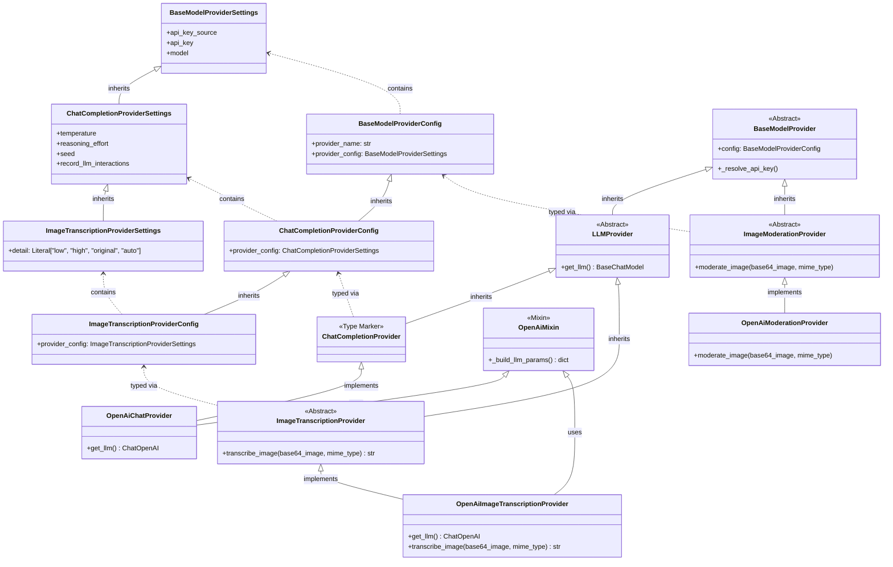

# Spec Review: Image Transcription Support
**Review ID:** 09_ag_gemini_3_1_pro_high_strictMode

## Summary of Detected Items
| Priority | ID | Title | Link | Status |
| :--- | :--- | :--- | :--- | :--- |
| High | `issue-caption-loss` | Caption formatting is completely lost when image is flagged by moderation | [Link](#issue-caption-loss) | READY |
| High | `issue-detail-placement` | `detail` field placement in config breaks `OpenAiMixin` kwargs | [Link](#issue-detail-placement) | READY |
| High | `issue-timeout-caption` | Timeouts in `BaseMediaProcessor` will not preserve image captions | [Link](#issue-timeout-caption) | READY |
| Medium | `issue-default-factory` | Complexity in constructing Pydantic `default_factory` for nested configs | [Link](#issue-default-factory) | READY |

---

## Detailed Items

### Caption formatting is completely lost when image is flagged by moderation
- **Priority**: High
- **ID**: `issue-caption-loss`
- **Status**: READY
- **Required Actions**: 
  1. Add a new boolean field `unprocessable_media` to the `ProcessingResult` model.
  2. Set `unprocessable_media = True` inside `ProcessingResult` when returning from Error Processors (`CorruptMediaProcessor`, `UnsupportedMediaProcessor`).
  3. Remove the manual bracket wrapping `[...]` and concatenation from the Error Processors since they will just return the base prefix.
  4. Set `unprocessable_media = True` inside `ProcessingResult` in `ImageVisionProcessor` when moderation fails.
  5. In `BaseMediaProcessor.process_job`, check if `result.unprocessable_media` is True. If so, automatically format the result content by wrapping it in brackets `[<content>]`.
  6. In `BaseMediaProcessor.process_job`, regardless of the processor type, if `result.unprocessable_media` is True AND a caption exists (`job.placeholder_message.content`), append `\n[Caption: <caption_text>]` to the result string.
  7. Remove the `caption: str` argument from the `process_media` signature in `BaseMediaProcessor` and update all subclass signatures to match, as individual processors will no longer need to manage captions.
- **Detailed Description**: The spec requires `ImageVisionProcessor.process_media` to handle caption formatting manually. However, in the Processing Flow section, if `moderation_result.flagged == true`, the processor is instructed to return *only* the static string `[cannot process image as it violates safety guidelines]`. If the original media message contained a text caption provided by the user, this strict literal return value will cause the caption to be entirely discarded, resulting in data loss from the user's perspective. The caption string must be correctly appended to the static moderation placeholder just like it is appended to the successful transcription result.

### `detail` field placement in config breaks `OpenAiMixin` kwargs
- **Priority**: High
- **ID**: `issue-detail-placement`
- **Status**: READY
- **Required Actions**: 
  1. Create a new `ImageTranscriptionProviderSettings` class that inherits from `ChatCompletionProviderSettings`.
  2. Add the `detail: Literal["low", "high", "original", "auto"] = "auto"` field to `ImageTranscriptionProviderSettings`.
  3. Modify `ImageTranscriptionProviderConfig` to define `provider_config: ImageTranscriptionProviderSettings` instead of putting the `detail` field directly on itself.
  4. Implement the following configuration inheritance structure to ensure the `detail` field is correctly caught by `model_dump()`:

- **Detailed Description**: The spec instructs extending `ChatCompletionProviderConfig` via a new `ImageTranscriptionProviderConfig` with an additional `detail` field. However, the shared `_build_llm_params()` method in the `OpenAiMixin` uses `self.config.provider_config.model_dump()` to extract all the LLM parameters. If `detail` is defined at the top-level outer config class rather than inside an inner settings object, it will not be present in the returned `params` dictionary. As a result, the `params.pop("detail", "auto")` instruction inside the provider initialization will silently fail to find the configured value, completely losing the `detail` configuration setting. The design must be corrected to define an `ImageTranscriptionProviderSettings` (extending `ChatCompletionProviderSettings`) to hold the `detail` field instead.

### Timeouts in `BaseMediaProcessor` will not preserve image captions
- **Priority**: High
- **ID**: `issue-timeout-caption`
- **Status**: READY
- **Required Actions**: 
  1. Add `unprocessable_media=True` to the `ProcessingResult` returned within the `asyncio.TimeoutError` exception block in `BaseMediaProcessor.process_job()`.
  2. Ensure the timeout block relies on the centralized caption formatting logic added as part of `issue-caption-loss` rather than implementing its own duplicate concatenation string.
- **Detailed Description**: The spec designates modifying `BaseMediaProcessor._handle_unhandled_exception` to append `\n[Image caption: <caption>]` during crash scenarios to ensure captions are never lost. However, there is a distinct `asyncio.TimeoutError` except block inside `BaseMediaProcessor.process_job` which specifically handles timeouts by constructing a `ProcessingResult` directly and thereby totally bypassing `_handle_unhandled_exception`. As a result, if an image transcription simply takes too long (a common occurrence with heavy vision payloads), the error will be caught gracefully but the caption will be dropped. The caption preservation logic must be explicitly added to the `TimeoutError` branch as well as the unhandled exception branch.

### Complexity in constructing Pydantic `default_factory` for nested configs
- **Priority**: Medium
- **ID**: `issue-default-factory`
- **Status**: READY
- **Required Actions**: 
  1. Remove the requirement from the spec to add a `default_factory` to `LLMConfigurations.image_transcription`.
  2. Define `image_transcription` as a strictly required field using `Field(...)` inside `LLMConfigurations` to keep it perfectly consistent with `high`, `low`, and `image_moderation`.
  3. Ensure that the database migration script (`migrate_image_transcription.py`) is the sole mechanism explicitly responsible for backfilling this data for old bots.
- **Detailed Description**: The spec mandates adding a `default_factory` to `LLMConfigurations.image_transcription` to build a complete fallback `ImageTranscriptionProviderConfig`. Constructing this nested object correctly requires access to `DefaultConfigurations` to populate the default provider name, API key source, etc. Because both classes reside in `config_models.py`, utilizing `DefaultConfigurations` before or during the class definition requires very careful block ordering or utilizing arbitrary lambda functions. While mechanically achievable, constructing such a deep nested object inside a model factory introduces maintenance overhead and potential static typing bugs. Since the spec already correctly requires a database migration script to backfill this field for old entries, strict reliance on runtime Pydantic fallback instantiation is slightly redundant and might be better fulfilled by relying solely on the DB migration approach.
