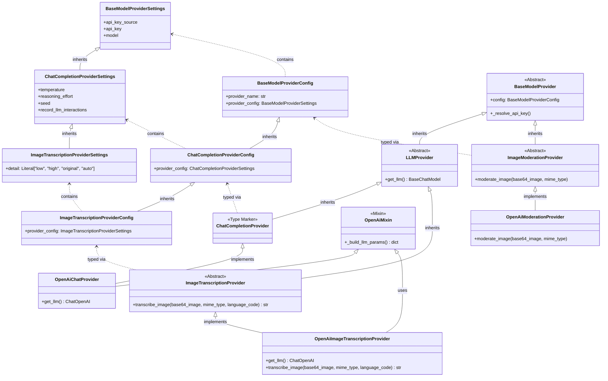

# Feature Specification: Image Transcription Support

## Overview
- This feature adds automatic image transcription to `ImageVisionProcessor`.
Every image processed by the media processing pipeline which arrives to the `ImageVisionProcessor` will be processed in order to produce a textual representation describing the image content
- this will be achieved by using a model provider external api


## Requirements

### Configuration
- `image_transcription` is added as a new per-bot tier in `LLMConfigurations` (alongside `high`, `low`, `image_moderation`), with defaults matching the `low` tier settings (same API-key source and chat settings), but the configuration should use new dedicated environment variables: `os.getenv("DEFAULT_MODEL_IMAGE_TRANSCRIPTION", "gpt-5-mini")`, `float(os.getenv("DEFAULT_IMAGE_TRANSCRIPTION_TEMPERATURE", "0.05"))`, and `os.getenv("DEFAULT_IMAGE_TRANSCRIPTION_REASONING_EFFORT", "minimal")`. The fallback values `"0.05"` and `"minimal"` match the existing `low` tier defaults and must always be specified to prevent startup crashes when the env vars are not set. The default provider module for this tier is `openAiImageTranscription`. Individual bots may override to any compatible chat model (e.g. `gpt-5`) through their config.
- Create a new `ImageTranscriptionProviderSettings` class inheriting from `ChatCompletionProviderSettings`, adding the `detail: Literal["low", "high", "original", "auto"] = "auto"` field.
- Modify `ImageTranscriptionProviderConfig` to extend `ChatCompletionProviderConfig` and redefine `provider_config: ImageTranscriptionProviderSettings`. The `LLMConfigurations.image_transcription` field type is `ImageTranscriptionProviderConfig`.
- `ConfigTier` is updated to include `"image_transcription"`.
- `resolve_model_config` in `services/resolver.py` returns `ImageTranscriptionProviderConfig` for the `"image_transcription"` tier.
- Create a new resolving function `resolve_bot_language(bot_id: str) -> str` inside `services/resolver.py` that fetches the `language_code` originating from the bot's `UserDetails` configuration. The function reads `config_data.configurations.user_details.language_code` from the bot configuration document explicitly executing its lookup using `get_global_state().configurations_collection.find_one(...)`. It should fall back to `"en"` if the document or the field is missing.
- `global_configurations.token_menu` is extended with an `"image_transcription"` pricing entry (as a distinct, independent tier — not reusing the `low` tier) so vision usage is tracked and priced under the correct tier. The pricing values are: `input_tokens: 0.25`, `cached_input_tokens: 0.025`, `output_tokens: 2.0` (matching the default model `gpt-5-mini` rates).
- `get_configuration_schema` in `routers/bot_management.py` must dynamically extract the list of LLM configuration tiers. Ensure the schema surgery loop iterates dynamically over the actual keys present in the schema definition: `for prop_name in llm_configs_defs['properties'].keys():`. Also, ensure the `reasoning_effort` title patches are applied to both `'ChatCompletionProviderSettings'` AND `'ImageTranscriptionProviderSettings'` to guarantee correct UI rendering for both tiers.

### Processing Flow
- Update `infrastructure/models.py` by adding `unprocessable_media: bool = False` to the `ProcessingResult` dataclass. Add a docstring comment explaining the semantic: *"True means the media could not be meaningfully transcribed, signaling `process_job` to skip prefix injection for the error payload."*
- `ImageVisionProcessor` requirements must officially add `"image/gif"` to the media processing pool definitions alongside JPEG, PNG, and WEBP, strictly passing it to OpenAI to leverage their native non-animated GIF support. This requires two changes:
  1. Update `DEFAULT_POOL_DEFINITIONS` in `services/media_processing_service.py` to include `"image/gif"` in the `ImageVisionProcessor` mime types list.
  2. Create a migration script (e.g., `scripts/migrations/migrate_pool_definitions_gif.py`) that completely **deletes** the existing `_mediaProcessorDefinitions` document from the MongoDB `configurations` collection. This is required because existing environments seed pool definitions into MongoDB on first run and subsequently read from DB — a code-only change to `DEFAULT_POOL_DEFINITIONS` will not affect already-initialized environments. On the next server boot after the document is deleted, the service will automatically recreate it from the updated Python defaults, successfully deploying GIF support.
- `ImageVisionProcessor` will first moderate the image (as it currently does)
- After `moderation_result` is obtained:
  - If `moderation_result.flagged == false`: proceed to transcribe the image (see below)
  - If `moderation_result.flagged == true`: return a `ProcessingResult` where `unprocessable_media = True` with static content: `"cannot process image as it violates safety guidelines"`. Set `failed_reason=None`. Flagged images are a successful detection, not a system failure. They intentionally bypass the `_failed` archive collection to avoid cluttering operational logs with user content violations. Do not return the specific tags that were flagged. Moderation flagging is treated as a normal processing outcome, not an error. The `BaseMediaProcessor` will automatically format the content and append captions correctly.

### Transcription
- `ImageVisionProcessor` will explicitly retrieve the bot's configured language by calling `resolve_bot_language(bot_id)` **inside the `if moderation_result.flagged == False` branch**, just before the transcription call, to avoid unnecessary DB queries on flagged images. It will then use the bot's `image_transcription` tier to resolve an `ImageTranscriptionProvider` and call `await provider.transcribe_image(base64_image, mime_type, language_code)` to transcribe the actual image bytes (base64-encoded) into a message describing the image. The `feature_name` passed to `create_model_provider` for this transcription call must be `"image_transcription"` (the second argument) to enable fine-grained token tracking. The moderation call should continue passing `"media_processing"` as its `feature_name`. **Note: This architecture intentionally instantiates two separate provider instances per image processed (one for moderation using `AsyncOpenAI`, one for transcription using `ChatOpenAI`), ensuring a clear separation of concerns and exact token tracking per feature. Also note that image moderation doesn't even really do token tracking behind the scenes.**
- **Important:** Unlike `resolve_model_config` (which raises `ValueError` if no config is found), `resolve_bot_language` must **never raise an error** under any circumstances. It must always fall back to `"en"` on any missing document, missing field, or any other error condition. Do not mirror `resolve_model_config`'s error-raising pattern in this function. The entire database fetch block inside the function must be wrapped in a bare `try/except Exception: return "en"` block.
- The transcription prompt is hardcoded in the provider (no system message) but injects the requested `language_code`: *"Describe the contents of this image explicitly in the following language: {language_code}, and concisely in 1-3 sentences. If there is text in the image, add the text inside image to description as well."*
- Transcription response normalization contract (must always produce a plain string):
  - If `response.content` is `str`: return it as-is.
  - If `response.content` is content blocks: extract text-bearing blocks in original order and concatenate into one deterministic string (single-space separator, trim outer whitespace).
  - If `response.content` is neither string nor content blocks: return `"Unable to transcribe image content"` (no brackets).
- **Error handling:** No custom error handling (`try/except`) should be added around `transcribe_image` within `ImageVisionProcessor`. All exceptions propagate up to `BaseMediaProcessor.process_job()`, which handles failures gracefully. The `asyncio.TimeoutError` exception block in `BaseMediaProcessor.process_job()` must return a `ProcessingResult` with `unprocessable_media=True` to preserve image captions during timeouts. Change the hardcoded content from `"[Processing timed out]"` to `"Processing timed out"`. The brackets must be removed from the raw string because `format_processing_result` will automatically wrap all strings in brackets. The final delivered string will still be `[Processing timed out]`.
  - **Note:** Unlike flagged moderation results (which bypass the `_failed` archive collection to avoid storing user violations), timeouts **must** retain a populated `failed_reason` (e.g., `failed_reason=f"TIMEOUT: processing exceeded {self.processing_timeout}s"`). This ensures timeout jobs are successfully processed by `_archive_to_failed()`, allowing system operators to monitor and investigate operational performance issues.

### Output Format
- The produced image transcript will be passed to the caller, arriving at the bot message queue as if it was a text message. Caption formatting is **centralized**. Update `BaseMediaProcessor.process_job()` to remove the `caption` argument from the `self.process_media` call. Also, update the `process_media` method signature in `BaseMediaProcessor` and explicitly all 7 affected subclasses (`ImageVisionProcessor`, `CorruptMediaProcessor`, `UnsupportedMediaProcessor`, `StubSleepProcessor`, `AudioTranscriptionProcessor`, `VideoDescriptionProcessor`, `DocumentProcessor`) to remove the `caption` parameter. The new abstract method signature must be exactly:
  ```python
  @abstractmethod
  async def process_media(self, file_path: str, mime_type: str, bot_id: str) -> ProcessingResult:
  ```
- Add explicit content definitions to the spec for each affected processor after the caption removal:
  - `CorruptMediaProcessor`: return `ProcessingResult(content=f"Corrupted {media_type} media could not be downloaded", failed_reason=..., unprocessable_media=True)` — no caption, no brackets. **Important:** The existing derivation `media_type = mime_type.replace("media_corrupt_", "")` must be preserved in the refactored method body. The `mime_type` for corrupt media jobs is stored as `"media_corrupt_image"`, `"media_corrupt_audio"`, etc., so this stripping logic is required for the content string to format correctly.
  - `UnsupportedMediaProcessor`: return `ProcessingResult(content=f"Unsupported media type: {mime_type}", failed_reason=..., unprocessable_media=True)` — no caption, no brackets.
  - `StubSleepProcessor` (and any inheriting stub processors): return `ProcessingResult(content=f"multimedia message with guid='{...}'")` — no redundant "Transcripted" phrasing, no brackets, `unprocessable_media` defaults to `False` (success path). (`process_job` now automatically prepends the transcription prefix).
- `format_processing_result(content: str, caption: str) -> str` **must be implemented as a module-level function inside `media_processors/base.py`**. This helper must be a **pure function** that returns the formatted string without mutating the original arguments. This helper must **unconditionally** wrap the raw content in brackets `[<content>]` (regardless of success or failure). If the `caption` argument is a **non-empty string** (`if caption:`), it must append the original caption (`\n[Caption: <caption_text>]`) to the result. If `caption` is `None` or an empty string (`""`), no suffix is appended — the result is returned as-is after bracket-wrapping.
- Update `BaseMediaProcessor._handle_unhandled_exception` to invoke `format_processing_result` explicitly. Inside `_handle_unhandled_exception`, the caption is sourced from `job.placeholder_message.content`. The `result.content = format_processing_result(result.content, caption)` reassignment **must be executed first**, before calling `_persist_result_first`, `_archive_to_failed`, and the best-effort queue injection via `update_message_by_media_id`. This ensures all three downstream operations automatically inherit the cleanly formatted string via `result.content` — no further changes to those methods are needed. Note: `_archive_to_failed` also reads `result.content` (stores it in the `_failed` collection), so it must also receive the formatted string via this same ordering.
- **`BaseMediaProcessor.process_job()` Refactoring:** Replace the partial instructions with the following exhaustive snippet to completely eliminate implementation ambiguity. This includes checking logic to inject a media-type prefix (`media_type = job.mime_type.replace("media_corrupt_", "").split("/")[0].capitalize()`) for successful jobs, and unconditional formatting calls:

  ```python
  async def process_job(self, job: MediaProcessingJob, get_bot_queues: Callable[[str], Any], db):
      """Full shared lifecycle — called by the worker pool for each job."""
      # Caption extracted once here; no longer passed to process_media.
      # Used by format_processing_result for all outcomes.
      caption = job.placeholder_message.content
      file_path = resolve_media_path(job.guid)
      try:
          # 1. ACTUAL CONVERSION (Externally Guarded by Centralized Timeout)
          try:
              result = await asyncio.wait_for(
                  self.process_media(file_path, job.mime_type, job.bot_id),  # caption removed
                  timeout=self.processing_timeout,
              )
          except asyncio.TimeoutError:
              result = ProcessingResult(
                  content="Processing timed out",  # no brackets — format_processing_result adds them
                  failed_reason=f"TIMEOUT: processing exceeded {self.processing_timeout}s",
                  unprocessable_media=True,
              )

          # 2. PREFIX INJECTION — classical success path only
          # Skipped when unprocessable_media=True (flagged, timeout, error processors)
          # or when failed_reason is set.
          if not result.unprocessable_media and not result.failed_reason:
              media_type = job.mime_type.replace("media_corrupt_", "").split("/")[0].capitalize()
              result.content = f"{media_type} Transcription: {result.content}"

          # 3. FORMAT — MUST happen before any persistence or delivery.
          # Unconditionally wraps content in brackets and appends caption if non-empty.
          # All three downstream operations (persist, archive, queue delivery) automatically
          # inherit the formatted string via result.content — no further changes needed.
          result.content = format_processing_result(result.content, caption)

          # 4. PERSISTENCE (Persistence-First — applies to ALL outcomes, success or failure)
          # On success: result goes to _jobs or _holding as status=completed for delivery/reaping.
          # On failure: same — error text is the result, stays in _holding for reaping on reconnect.
          persisted = await self._persist_result_first(job, result, db)
          if not persisted:
              return  # Job was already swept by cleanup — no further action

          # 5. ARCHIVE TO FAILED (operator inspection only — does not affect delivery flow)
          # A copy is inserted into _failed so operators can investigate. It is never read back
          # by any recovery mechanism — delivery is handled exclusively via the _holding reaping path.
          # Note: flagged images have failed_reason=None, so they bypass this collection intentionally.
          if result.failed_reason:
              await self._archive_to_failed(job, result, db)

          # 6. BEST-EFFORT DIRECT DELIVERY (bot is active)
          bot_queues = get_bot_queues(job.bot_id)
          if bot_queues:
              delivered = await bot_queues.update_message_by_media_id(
                  job.correspondent_id, job.guid, result.content
              )
              if delivered:
                  # Delivered — remove the job from active/holding (mission complete)
                  await self._remove_job(job, db)
              else:
                  # Placeholder not found in the queue (queue was reset) — unrecoverable
                  logging.warning(
                      f"MEDIA PROCESSOR: Placeholder not found for GUID {job.guid} while bot is active; "
                      "removing job as unrecoverable."
                  )
                  await self._remove_job(job, db)

          # If bot is NOT active: job stays in _holding as status=completed.
          # When the bot eventually reconnects, the normal reaping path will find it,
          # inject the placeholder, deliver, and delete it.

      except Exception as e:
          logging.exception("MEDIA PROCESSOR: unhandled exception")
          await self._handle_unhandled_exception(job, db, str(e), get_bot_queues)
      finally:
          # GUARANTEE: The media file is always removed from the shared staging volume
          delete_media_file(job.guid)
  ```
- Update `BaseMediaProcessor._handle_unhandled_exception` to ensure its `ProcessingResult` correctly sets `unprocessable_media=True` and change its hardcoded content from `"[Media processing failed]"` to `"Media processing failed"` to avoid double-wrapping. For example:
  ```python
  async def _handle_unhandled_exception(self, job, db, error, get_bot_queues=None):
      caption = job.placeholder_message.content
      result = ProcessingResult(content="Media processing failed", failed_reason=error, unprocessable_media=True)
      result.content = format_processing_result(result.content, caption)  # MUST be first, before persistence
      persisted = await self._persist_result_first(job, result, db)
      # ...
  ```

## Relevant Background Information
### Project Files
- `media_processors/base.py`
- `media_processors/stub_processors.py`
- `media_processors/media_file_utils.py`
- `media_processors/factory.py`
- `media_processors/error_processors.py`
- `media_processors/image_vision_processor.py`
- `media_processors/__init__.py`
- `model_providers/base.py`
- `model_providers/openAi.py`
- `model_providers/openAiModeration.py`
- `model_providers/image_moderation.py`
- `model_providers/chat_completion.py`
- `model_providers/image_transcription.py` *(new — abstract `ImageTranscriptionProvider`)*
- `model_providers/openAiImageTranscription.py` *(new — concrete `OpenAiImageTranscriptionProvider`)*
- `services/media_processing_service.py`
- `services/model_factory.py`
- `services/resolver.py`
- `routers/bot_management.py`
- `scripts/migrations/migrate_image_transcription.py` *(new)*
- `scripts/migrations/initialize_quota_and_bots.py` *(update for image_transcription token menu tier)*
- `scripts/migrations/migrate_token_menu_image_transcription.py` *(new)*
- `scripts/migrations/migrate_pool_definitions_gif.py` *(new — deletes _mediaProcessorDefinitions from MongoDB to force GIF pool recreation)*
- `utils/provider_utils.py`
- `config_models.py`
- `queue_manager.py`
- `infrastructure/models.py`
- `services/quota_service.py`


*(Note: References to `global_configurations.token_menu` in this spec refer to the MongoDB collection document in `COLLECTION_GLOBAL_CONFIGURATIONS`, not a Python module.)*

### External Resource
- https://developers.openai.com/api/docs/guides/images-vision?format=base64-encoded

## Technical Details

### 1) Provider Architecture
We adopt a "Sibling Architecture" for providers to eliminate inheritance clashes during type checking.



- Define a new abstract base class `LLMProvider` in `model_providers/base.py` that inherits from `BaseModelProvider` and declares the abstract `get_llm() -> BaseChatModel` method. Modify `ChatCompletionProvider` to inherit from `LLMProvider` instead of `BaseModelProvider` and become an empty type-marker class. Explicitly remove the `@abstractmethod def get_llm(self)` declaration and `abc` imports from `model_providers/chat_completion.py`, replacing the `ChatCompletionProvider` class body with `pass` so it cleanly acts as an empty type-marker.
- `ImageTranscriptionProvider` (in `model_providers/image_transcription.py`) extends `LLMProvider` and declares `async def transcribe_image(base64_image: str, mime_type: str, language_code: str) -> str` as an abstract method.
- Define a centralized `OpenAiMixin` containing only `_build_llm_params()` - the shared OpenAI kwargs building logic (`model_dump()` -> pop common custom fields `api_key_source`, `record_llm_interactions` -> resolve API key -> filter None-valued optional fields like `reasoning_effort`, `seed`). `_resolve_api_key()` stays in `BaseModelProvider` as it is provider-agnostic. Note: `_resolve_base_url` was an error in previous specs and should be ignored. `OpenAiMixin` relies on `self.config` and inherited methods like `_resolve_api_key()`. It is designed strictly to be mixed into subclasses of `BaseModelProvider`.
- **Constraint:** Add an explicit comment inside `BaseModelProvider._resolve_api_key()` defining that it must remain strictly synchronous and perform no external I/O or background async polling, relying strictly on the pre-resolved synchronous `self.config` properties (this is required because `ChatOpenAI` instantiation happens inside synchronous `__init__` constructors).
- `OpenAiImageTranscriptionProvider` (in `model_providers/openAiImageTranscription.py`) extends `ImageTranscriptionProvider` and `OpenAiMixin`. `OpenAiChatProvider` must be refactored to use this same `OpenAiMixin` to reuse logic without duplicating it. Extract the `httpx` logger configuration from `OpenAiChatProvider.get_llm()` and move it entirely out of the model providers and into the application's startup file (e.g., `main.py`). This avoids embedding process state side-effects within a parameter builder method. Remove the `print()` debug statements entirely — they are dev-only artifacts not suitable for production. As part of this extraction, `get_llm()` will become a trivial `return self._llm`. Both concrete classes call `self._build_llm_params()` in their `__init__` to create and store the `ChatOpenAI` instance. Each subclass is responsible for popping its own extra fields before passing kwargs to `ChatOpenAI(...)`. Use constructor-time initialization: create the `ChatOpenAI` instance inside `__init__` and store it as `self._llm`. Make `get_llm()` simply return `self._llm`.
- In `OpenAiImageTranscriptionProvider.__init__`, call `params = self._build_llm_params()`, then pop `detail` (`self._detail = params.pop("detail", "auto")`), then `self._llm = ChatOpenAI(**params)`. `self._detail` is then used only when constructing the multimodal image payload inside `transcribe_image()`.
- `OpenAiImageTranscriptionProvider` implements `transcribe_image` by constructing a multimodal `HumanMessage` (text prompt incorporating the `language_code` parameter + `image_url` data URI + `detail` from config), invoking the LLM via `ainvoke`, and returning the normalized transcript string according to the transcription response normalization contract above. Callers (e.g., `ImageVisionProcessor.process_media`) must `await` the method.

Contract skeleton for implementers:

```python
from abc import ABC, abstractmethod

class ImageTranscriptionProvider(LLMProvider, ABC):
    # Inherits abstract get_llm() -> BaseChatModel from LLMProvider
    @abstractmethod
    async def transcribe_image(self, base64_image: str, mime_type: str, language_code: str) -> str:
        ...
```

`create_model_provider` return type annotation must be updated to `Union[BaseChatModel, ImageModerationProvider, ImageTranscriptionProvider]`. Update the docstring to clearly document the return contract, specifically noting that the `image_transcription` tier returns the provider wrapper, not a raw `BaseChatModel`. Specifically: `ChatCompletionProvider` returns raw `BaseChatModel` with callback attached; `ImageModerationProvider` returns provider directly; `ImageTranscriptionProvider` returns provider directly.

`create_model_provider` in `services/model_factory.py` keeps the existing `ChatCompletionProvider` tracking path structure. Refactor `create_model_provider` to use a unified `isinstance(provider, LLMProvider)` branch for token tracking, with only the return value differing per subtype:

```text
┌─────────────────────────────────────────────┐
│         create_model_provider()             │
│                                             │
│  1. resolve config + load provider          │
│                                             │
│  2. isinstance(provider, LLMProvider)?      │
│     │                                       │
│     YES → llm = provider.get_llm()          │
│           attach TokenTrackingCallback(llm) │
│           │                                 │
│           isinstance(ChatCompletionProvider)│
│             YES → return llm (raw)          │
│             NO  → return provider (wrapper) │
│                                             │
│     NO → isinstance(ImageModerationProvider)│
│            YES → return provider            │
│                  (no LLM, no token tracking)│
└─────────────────────────────────────────────┘
```

Both `OpenAiChatProvider` and `OpenAiImageTranscriptionProvider` must use constructor-time initialization: create the `ChatOpenAI` instance inside `__init__` and store it as `self._llm`. Make `get_llm()` simply return `self._llm`. This guarantees the `TokenTrackingCallback` attached by the factory in `create_model_provider` is always on the same object used by `transcribe_image()`.

`find_provider_class` in `utils/provider_utils.py` must include an `obj.__module__ == module.__name__` filter in its `inspect.getmembers` loop. This ensures that `inspect.getmembers()` only picks the provider class defined in that specific file, ignoring imported base classes or other providers. Add a documentation note clarifying that this filter is purely a defensive measure intended to protect against edge-case concrete sibling imports (e.g., if another concrete provider class was imported solely for type-checking). Also, ensure the existing `not inspect.isabstract(obj)` check remains to ignore abstract base classes.

### 2) OpenAI Vision Parameter
The provider reads the `detail` parameter from its `ImageTranscriptionProviderSettings` (default `"auto"`, see OpenAI docs on [Images and vision](https://developers.openai.com/api/docs/guides/images-vision?format=base64-encoded)). The `detail` parameter controls image tokenization fidelity (how many patches/tiles the image is broken into). Valid values: `"low"`, `"high"`, `"original"`, `"auto"`. It defaults to `"auto"` but is overridable per-bot through config. `detail` is transcription-only metadata and must never be forwarded into `ChatOpenAI(...)` constructor kwargs; it is used only when building the multimodal image payload in `transcribe_image(...)`. The decision to omit validation for the `"original"` detail level against the configured model is an **accepted, deliberate design choice**, and we explicitly do not want to add validation guards for it. If configured with an unsupported model (e.g., `gpt-5-mini` instead of `gpt-5.4`), the system accepts that the raw OpenAI API error will simply propagate and cause a failure through the standard implicit error handling path. *(Note: this runtime error behavior for mismatched detail levels and models is a known and acceptable behavior that was already approved in this specification.)*

### 3) Deployment Checklist
1. Add migration script `scripts/migrations/migrate_image_transcription.py` to iterate existing bot configs in MongoDB and add `config_data.configurations.llm_configs.image_transcription` where missing (following existing migration patterns). This migration must target `infrastructure/db_schema.py::COLLECTION_BOT_CONFIGURATIONS`.
2. Extend `DefaultConfigurations` in `config_models.py` with `model_provider_name_image_transcription = "openAiImageTranscription"` (must match provider module name) and defaults for the image transcription model/settings using `os.getenv("DEFAULT_MODEL_IMAGE_TRANSCRIPTION", "gpt-5-mini")`, as well as introducing new dedicated environment variables with **explicit fallback values**: `float(os.getenv("DEFAULT_IMAGE_TRANSCRIPTION_TEMPERATURE", "0.05"))` and `os.getenv("DEFAULT_IMAGE_TRANSCRIPTION_REASONING_EFFORT", "minimal")`. The fallback values match the existing `low` tier defaults and must be specified to prevent startup crashes when the env vars are not set.
3. Update `get_bot_defaults` in `routers/bot_management.py` to include `image_transcription` in `LLMConfigurations` using `ImageTranscriptionProviderConfig` and `DefaultConfigurations`.
4. Define `LLMConfigurations.image_transcription` as a strictly required field using `Field(...)` inside `LLMConfigurations` to keep it consistent with the other tiers. Rely solely on the database migration script (`migrate_image_transcription.py`) to backfill this data for old bots. Note: Making the field required is safe because the deployment sequence **must** ensure the migration script runs successfully before the new code is activated, guaranteeing that all bot documents in the database already contain the tier.
5. Update `scripts/migrations/initialize_quota_and_bots.py` to include the `image_transcription` tier in the `token_menu` dictionary, bringing the total to 3 tiers (`high`, `low`, `image_transcription`). Its internal logic must remain safely explicitly "insert-if-not-exists" to protect manually added auxiliary fields. Add a comment in the code highlighting that `image_moderation` is intentionally omitted from the `token_menu` because it has no model-token cost calculation.
6. Create `scripts/migrations/migrate_token_menu_image_transcription.py` to patch existing environments using the same 3-tier menu. This script should completely delete any existing `token_menu` document and re-insert the full correct menu from scratch, acting as a hard reset. This "hard reset" strategy is acceptable because there is currently no actual production environment, so the risk of data loss or service disruption is zero.
7. `QuotaService.load_token_menu()` (`services/quota_service.py`) must remain a **read-only fetch** — do NOT add any self-healing insert logic. If the `token_menu` document is missing, `load_token_menu()` should continue to log an error as it currently does. The creation of the `token_menu` from scratch (including the new `image_transcription` tier) is handled entirely by the pre-boot migration script (`migrate_token_menu_image_transcription.py`), which must be run before the server starts.
8. Migration contract: all migration scripts for this feature must import and use `infrastructure/db_schema.py` constants (no hardcoded collection names).
9. Verification checklist for rollout:
   - Capture pre/post document counts for both target collections (`COLLECTION_BOT_CONFIGURATIONS`, `COLLECTION_GLOBAL_CONFIGURATIONS`).
   - Validate sample bot documents now include `config_data.configurations.llm_configs.image_transcription`.
   - Validate global token menu includes the `image_transcription` tier with expected pricing fields.
   - **Deployment window risk (accepted behavior):** During the migration window, `GET /{bot_id}` calls for un-migrated bots will return a 500 error because `model_validate` will raise a Pydantic `ValidationError` for the missing required `image_transcription` field. This is accepted design behavior; the API is not expected to work until the migration scripts have completely finished running.
10. Delete the unused dead code `LLMProviderSettings` and `LLMProviderConfig` entirely from `config_models.py` to prevent any confusion with the active `ChatCompletionProviderConfig` family of classes.

### 4) New Configuration Tier Checklist
When adding a new tier like `image_transcription`, the following files require updates:
1. `config_models.py`: Add `"image_transcription"` to the `ConfigTier` Literal type. The exact required update is:
   ```python
   ConfigTier = Literal["high", "low", "image_moderation", "image_transcription"]
   ```
   Add a comment directly above the `LLMConfigurations` model and the `ConfigTier` Literal explicitly stating: *"These two locations are the ONLY places in the code where the structure/keys of the tiers are defined."* (Note: we use `LLMConfigurations.model_fields.keys()` where possible).
2. `services/resolver.py`: Add the `@overload async def resolve_model_config(bot_id: str, config_tier: Literal["image_transcription"]) -> ImageTranscriptionProviderConfig` type hint, AND the implementation `elif` branch returning `ImageTranscriptionProviderConfig.model_validate(tier_data)`. Import `ImageTranscriptionProviderConfig` explicitly to ensure precise return type tracking.
3. `routers/bot_management.py`: Ensure the schema surgery loop iterates dynamically over the actual keys present in the schema definition: `for prop_name in llm_configs_defs['properties'].keys():` instead of the hardcoded `['high', 'low', 'image_moderation']` list so it automatically extracts the new tier. Also ensure the `reasoning_effort` title patches are applied to both `'ChatCompletionProviderSettings'` AND `'ImageTranscriptionProviderSettings'` to guarantee correct UI rendering for both tiers.
4. `frontend/src/pages/EditPage.js`: The UI MUST NOT hardcode the list of tiers. Abandon the `getAvailableTiers` JS helper approach that attempts to parse the OpenAPI schema structure (which uses `$ref` pointers and will not have inline `properties` at that path). Instead:
   - Create a new lightweight API endpoint `GET /api/internal/bots/tiers` in `bot_management.py` that directly returns the available tiers by reading `LLMConfigurations.model_fields.keys()` from the Python model. This correctly aligns with the existing `/api/internal/bots` router prefix.
   - Update `EditPage.js` to fetch from this new endpoint (`/api/internal/bots/tiers` or mapped equivalent via gateway) during `fetchData` and store the result in component state.
   - Replace every occurrence of the hardcoded tier array `["high", "low", "image_moderation"]` (specifically around line 135 for `api_key_source` and line 229 for `handleFormChange`) with the dynamically fetched tier list from state.
5. `frontend/src/pages/EditPage.js`: Statically add a fourth entry to the `llm_configs` object in `uiSchema` for `image_transcription`. The `ui:title` should be `"Image Transcription Model"`, and the rest of the template configuration should match the other tiers exactly (e.g., `"ui:ObjectFieldTemplate": NestedCollapsibleObjectFieldTemplate`). **Important:** The `provider_config` sub-object within the `image_transcription` uiSchema entry must be identical to the `high` and `low` tiers' `provider_config` entries, including `api_key_source`, `reasoning_effort`, and `seed` UI title properties, and the `FlatProviderConfigTemplate`. Omitting this sub-entry would cause incorrect UI rendering for those fields. **Include the `detail` field inside `provider_config` with a `ui:title` of `"Image Detail Level"`, while matching the structure of the other fields exactly.**

### 5) Test Expectations
- Add tests that verify `detail` is filtered from `ChatOpenAI(...)` constructor kwargs and only used in transcription payload construction.
- Add tests that verify callback continuity: callback attachment in `create_model_provider` and transcription invocation in `transcribe_image(...)` use the same LLM object reference.
- Add tests for transcription normalization covering all branches:
  - string content -> returned as-is,
  - content blocks -> concatenated deterministic string,
  - unsupported content type -> `"Unable to transcribe image content"`.
- Add test that `moderation_result.flagged == True` returns `ProcessingResult(unprocessable_media=True, content="cannot process image as it violates safety guidelines")`.
- Add test that `format_processing_result` formats strings with unconditional bracket wrapping, and correctly omits or adds captions based on `job.placeholder_message.content`.
- Add test that caption is correctly appended when `job.placeholder_message.content` is populated, regardless of whether processing succeeded or failed.
- Add test that the `asyncio.TimeoutError` path returns `ProcessingResult` with `unprocessable_media=True`.
- **Unit-level (`process_media` return):** Update existing tests to assert that `process_media()` returns raw, unbracketed content strings (e.g., `"Transcripted audio multimedia message..."`) — no legacy `[...]` wrapper. This verifies the removal of legacy bracket wrapping.
- **Integration-level (`process_job` end-to-end):** Add new tests that assert the final string delivered to the bot queue (via `update_message_by_media_id`) is the fully formatted `"[{MediaType} Transcription: {content}]"` form — e.g., `"[Audio Transcription: Transcripted audio multimedia message...]"`.
- **Update existing tests for renamed content strings:** Any existing tests that assert the old content strings for `UnsupportedMediaProcessor` (previously `"Unsupported {mime_type} media"`) or `CorruptMediaProcessor` (previously `"Corrupted {media_type} media could not be downloaded"` with old bracket wrapping) must be updated to match the new spec-defined content strings: `f"Unsupported media type: {mime_type}"` and `f"Corrupted {media_type} media could not be downloaded"` (unbracketed, with brackets added by `format_processing_result`).
- The `test_process_media_bot_id_signature` test in `tests/test_image_vision_processor.py` must precisely be updated: rewrite the test assertion entirely to use a robust dictionary key lookup (e.g., `assert "bot_id" in sig.parameters`) rather than asserting on hardcoded list index offsets like `params[3]`.
