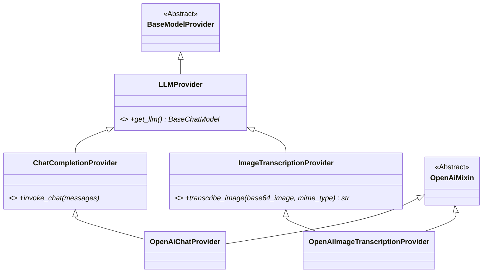

# Feature Specification: Image Transcription Support

## Overview
- This feature adds automatic image transcription to `ImageVisionProcessor`.
Every image processed by the media processing pipeline which arrives to the `ImageVisionProcessor` will be processed in order to produce a textual representation describing the image content
- this will be achieved by using a model provider external api


## Requirements

### Configuration
- `image_transcription` is added as a new per-bot tier in `LLMConfigurations` (alongside `high`, `low`, `image_moderation`), with defaults matching the `low` tier model/settings (`gpt-5-mini`, same API-key source and chat settings). The default provider module for this tier is `openAiImageTranscription`. Individual bots may override to any compatible chat model (e.g. `gpt-5`) through their config.
- A new `ImageTranscriptionProviderConfig` extends `ChatCompletionProviderConfig` with an additional `detail: Literal["low", "high", "original", "auto"] = "auto"` field. The `LLMConfigurations.image_transcription` field type is `ImageTranscriptionProviderConfig`.
- `ConfigTier` is updated to include `"image_transcription"`.
- `resolve_model_config` in `services/resolver.py` returns `ImageTranscriptionProviderConfig` for the `"image_transcription"` tier.
- `global_configurations.token_menu` is extended with an `"image_transcription"` pricing entry (as a distinct, independent tier — not reusing the `low` tier) so vision usage is tracked and priced under the correct tier. The pricing values are: `input_tokens: 0.25`, `cached_input_tokens: 0.025`, `output_tokens: 2.0` (matching the default model `gpt-5-mini` rates).
- `get_configuration_schema` in `routers/bot_management.py` must dynamically extract the list of LLM configuration tiers from the overarching configuration model's fields (rather than a hardcoded list) so that schema surgery patches all tiers including `image_transcription` and future tiers automatically. Iterate over `LLMConfigurations.model_fields.keys()` to obtain the tier names for schema surgery, replacing the hardcoded list.

### Processing Flow
- `ImageVisionProcessor` will first moderate the image (as it currently does)
- After `moderation_result` is obtained:
  - If `moderation_result.flagged == false`: proceed to transcribe the image (see below)
  - If `moderation_result.flagged == true`: return a clean placeholder (no `failed_reason`, no failure archival) with content: `"[Transcribed image multimedia message was flagged with following problematic tags: ('tag1', 'tag2', ...)]"` where the tags are the keys from `moderation_result.categories` whose value is `true`. Moderation flagging is treated as a normal processing outcome, not an error.

### Transcription
- `ImageVisionProcessor` will use the bot's `image_transcription` tier to resolve an `ImageTranscriptionProvider` and call `await provider.transcribe_image(base64_image, mime_type)` to transcribe the actual image bytes (base64-encoded) into a message describing the image. The `feature_name` passed to `create_model_provider` for this call must be `"image_transcription"` to enable fine-grained token tracking and billing distinction from other media processing tasks.
- The transcription prompt is hardcoded in the provider (no system message): *"Describe the contents of this image concisely in 1-3 sentences, if there is text in the image add the text inside image to description as well"*
- Transcription response normalization contract (must always produce a plain string):
  - If `response.content` is `str`: return it as-is.
  - If `response.content` is content blocks: extract text-bearing blocks in original order and concatenate into one deterministic string (single-space separator, trim outer whitespace).
  - If `response.content` is neither string nor content blocks: return `"[Unable to transcribe image content]"`.
- **Error handling:** No custom error handling (`try/except`) should be added around `transcribe_image` within `ImageVisionProcessor`. All exceptions propagate up to `BaseMediaProcessor.process_job()`, which handles failures gracefully by logging the error, archiving the job to the failed collection, and returning the standard `[Media processing failed]` placeholder to the user. This maintains consistency with the existing `moderate_image` implementation.

### Output Format
- The produced image transcript will be formatted and passed to the caller, arriving at the bot message queue as if it was a text message (using base media processor existing mechanism).
- Caption handling — if the original WhatsApp message included a caption, it is appended:

  With caption:
  ```
  [Attached image description: <transcription>]
  [Image caption: <caption>]
  ```

  Without caption:
  ```
  [Attached image description: <transcription>]
  ```

## Relevant Background Information
### Project Files
- `media_processors/base.py`
- `media_processors/stub_processors.py`
- `media_processors/media_file_utils.py`
- `media_processors/factory.py`
- `media_processors/error_processors.py`
- `media_processors/image_vision_processor.py`
- `media_processors/__init__.py`
- `model_providers/base.py`
- `model_providers/openAi.py`
- `model_providers/openAiModeration.py`
- `model_providers/image_moderation.py`
- `model_providers/chat_completion.py`
- `model_providers/image_transcription.py` *(new — abstract `ImageTranscriptionProvider`)*
- `model_providers/openAiImageTranscription.py` *(new — concrete `OpenAiImageTranscriptionProvider`)*
- `services/media_processing_service.py`
- `services/model_factory.py`
- `services/resolver.py`
- `routers/bot_management.py`
- `scripts/migrations/migrate_image_transcription.py` *(new)*
- `scripts/migrations/initialize_quota_and_bots.py` *(update for image_transcription token menu tier)*
- `scripts/migrations/migrate_token_menu_image_transcription.py` *(new)*
- `global_configurations` *(token menu update for image transcription tier pricing)*
- `utils/provider_utils.py`
- `config_models.py`
- `queue_manager.py`
- `infrastructure/models.py`


### External Resource
- https://developers.openai.com/api/docs/guides/images-vision?format=base64-encoded

## Technical Details

### 1) Provider Architecture
We adopt a "Sibling Architecture" for providers to eliminate inheritance clashes during type checking.



- Define a new abstract base class `LLMProvider` (or `BaseLLMProvider`) in `model_providers/base.py` that inherits from `BaseModelProvider` and declares the abstract `get_llm() -> BaseChatModel` method. Modify `ChatCompletionProvider` to inherit from `LLMProvider` instead of `BaseModelProvider`.
- `ImageTranscriptionProvider` (in `model_providers/image_transcription.py`) extends `LLMProvider` and declares `async def transcribe_image(base64_image: str, mime_type: str) -> str` as an abstract method.
- Define a centralized `OpenAiMixin` containing the shared OpenAI initialization logic (`_resolve_base_url`, kwargs filtering, API key handling).
- `OpenAiImageTranscriptionProvider` (in `model_providers/openAiImageTranscription.py`) extends `ImageTranscriptionProvider` and `OpenAiMixin`. `OpenAiChatProvider` must be refactored to use this same `OpenAiMixin` to reuse logic without duplicating it. Both implement `get_llm()` to return `ChatOpenAI`. 
- `OpenAiImageTranscriptionProvider` implements `transcribe_image` by constructing a multimodal `HumanMessage` (text prompt + `image_url` data URI + `detail` from config), invoking the LLM via `ainvoke`, and returning the normalized transcript string according to the transcription response normalization contract above. Callers (e.g., `ImageVisionProcessor.process_media`) must `await` the method.

Contract skeleton for implementers:

```python
from abc import ABC, abstractmethod

class ImageTranscriptionProvider(LLMProvider, ABC):
    @abstractmethod
    async def transcribe_image(self, base64_image: str, mime_type: str) -> str:
        ...
```

`create_model_provider` in `services/model_factory.py` keeps the existing `ChatCompletionProvider` tracking path: resolve provider -> call `get_llm()` -> attach `TokenTrackingCallback`. With the sibling structure in place, `model_factory.py` should implement separate `isinstance` branches for the sibling types. `services/model_factory.py` must import the new `ImageTranscriptionProvider` class from `model_providers.image_transcription` so it can be used securely in the `isinstance` provider type check. For the `ImageTranscriptionProvider` subtype specifically, the factory returns the provider object (not raw LLM) so callers can `await provider.transcribe_image(...)`; for regular chat providers, it continues returning the raw tracked LLM. Callback continuity is a strict contract: for image transcription providers, `get_llm()` must be idempotent and return the same in-memory `ChatOpenAI` instance for the provider lifetime. This guarantees the `TokenTrackingCallback` attached by the factory is present on the exact same LLM object later used by `transcribe_image`.

`find_provider_class` in `utils/provider_utils.py` must include an `obj.__module__ == module.__name__` filter in its `inspect.getmembers` loop. This prevents imported concrete parent classes (e.g., `OpenAiChatProvider` imported into `openAiImageTranscription.py`) from being returned instead of the module's own provider class, since `inspect.getmembers` returns members alphabetically and would otherwise match the imported class first.

### 2) OpenAI Vision Parameter
The provider reads the `detail` parameter from its `ImageTranscriptionProviderConfig` (default `"auto"`, see OpenAI docs on [Images and vision](https://developers.openai.com/api/docs/guides/images-vision?format=base64-encoded)). The `detail` parameter controls image tokenization fidelity (how many patches/tiles the image is broken into). Valid values: `"low"`, `"high"`, `"original"`, `"auto"`. It defaults to `"auto"` but is overridable per-bot through config. `detail` is transcription-only metadata and must never be forwarded into `ChatOpenAI(...)` constructor kwargs; it is used only when building the multimodal image payload in `transcribe_image(...)`. No validation is added for the `"original"` detail level against the configured model; if misconfigured with an unsupported model (e.g., `gpt-5-mini`), the resulting OpenAI API error will propagate through the standard implicit error handling path.

### 3) Deployment Checklist
1. Add migration script `scripts/migrations/migrate_image_transcription.py` to iterate existing bot configs in MongoDB and add `config_data.configurations.llm_configs.image_transcription` where missing (following existing migration patterns). This migration must target `infrastructure/db_schema.py::COLLECTION_BOT_CONFIGURATIONS`.
2. Extend `DefaultConfigurations` in `config_models.py` with `model_provider_name_image_transcription = "openAiImageTranscription"` (must match provider module name) and defaults for the image transcription model/settings.
3. Update `get_bot_defaults` in `routers/bot_management.py` to include `image_transcription` in `LLMConfigurations` using `ImageTranscriptionProviderConfig` and `DefaultConfigurations`.
4. Define `LLMConfigurations.image_transcription` with a `default_factory` that builds a complete `ImageTranscriptionProviderConfig` to avoid validation failures on stored configs that predate this tier.
5. Update `scripts/migrations/initialize_quota_and_bots.py` so new deployments are initialized with the `image_transcription` token menu tier. Create `scripts/migrations/migrate_token_menu_image_transcription.py` to patch existing staging and production environments. This migration must target `infrastructure/db_schema.py::COLLECTION_GLOBAL_CONFIGURATIONS`. The script must use an idempotent `$set` operation with `upsert=True` to handle both existing and missing `token_menu` scenarios safely:
   `await global_config_collection.update_one({"_id": "token_menu"}, {"$set": {"image_transcription": {"input_tokens": 0.25, "cached_input_tokens": 0.025, "output_tokens": 2.0}}}, upsert=True)`
   Execute this migration script for existing deployments.
6. Migration contract: all migration scripts for this feature must import and use `infrastructure/db_schema.py` constants (no hardcoded collection names).
7. Verification checklist for rollout:
   - Capture pre/post document counts for both target collections (`COLLECTION_BOT_CONFIGURATIONS`, `COLLECTION_GLOBAL_CONFIGURATIONS`).
   - Validate sample bot documents now include `config_data.configurations.llm_configs.image_transcription`.
   - Validate global token menu includes the `image_transcription` tier with expected pricing fields.

### 4) New Configuration Tier Checklist
When adding a new tier like `image_transcription`, the following files require updates:
1. `config_models.py`: Add `"image_transcription"` to the `ConfigTier` Literal type. Add a comment directly above the `LLMConfigurations` model and the `ConfigTier` Literal explicitly stating: *"These two locations are the ONLY places in the code where the structure/keys of the tiers are defined. However, when adding a new tier, you MUST also update the `if/elif` logic inside `services/resolver.py` because the new tier has a different logic shape."*
2. `services/resolver.py`: Add the `@overload async def resolve_model_config(bot_id: str, config_tier: Literal["image_transcription"]) -> ImageTranscriptionProviderConfig` type hint, AND the implementation `elif` branch returning `ImageTranscriptionProviderConfig.model_validate(tier_data)`.
3. `routers/bot_management.py`: Ensure the schema surgery loop iterates over `LLMConfigurations.model_fields.keys()` so it automatically extracts the new tier without manual list updates.
4. `frontend/src/pages/EditPage.js`: The UI MUST NOT hardcode the list of tiers. Update `EditPage.js` to dynamically extract the available tiers from the API schema instead of using the hardcoded array `['high', 'low', 'image_moderation']`. Use the following implementation pattern:
   ```javascript
   // Extract dynamically from the API schema!
   const availableTiers = Object.keys(schemaData.properties.configurations.properties.llm_configs.properties);
   // Then use it everywhere:
   availableTiers.forEach(type => { ... })
   ```

### 5) Test Expectations
- Add tests that verify `detail` is filtered from `ChatOpenAI(...)` constructor kwargs and only used in transcription payload construction.
- Add tests that verify callback continuity: callback attachment in `create_model_provider` and transcription invocation in `transcribe_image(...)` use the same LLM object reference.
- Add tests for transcription normalization covering all branches:
  - string content -> returned as-is,
  - content blocks -> concatenated deterministic string,
  - unsupported content type -> `"[Unable to transcribe image content]"`.
