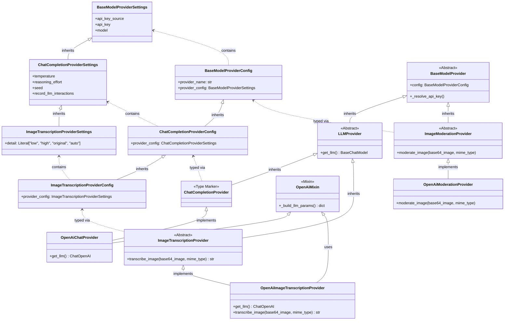

# Feature Specification: Image Transcription Support

## Overview
- This feature adds automatic image transcription to `ImageVisionProcessor`.
Every image processed by the media processing pipeline which arrives to the `ImageVisionProcessor` will be processed in order to produce a textual representation describing the image content
- this will be achieved by using a model provider external api


## Requirements

### Configuration
- `image_transcription` is added as a new per-bot tier in `LLMConfigurations` (alongside `high`, `low`, `image_moderation`), with defaults matching the `low` tier settings (same API-key source and chat settings), but the configuration should use new dedicated environment variables: `os.getenv("DEFAULT_MODEL_IMAGE_TRANSCRIPTION", "gpt-5-mini")`, `os.getenv("DEFAULT_IMAGE_TRANSCRIPTION_TEMPERATURE")`, and `os.getenv("DEFAULT_IMAGE_TRANSCRIPTION_REASONING_EFFORT")`. The default provider module for this tier is `openAiImageTranscription`. Individual bots may override to any compatible chat model (e.g. `gpt-5`) through their config.
- Create a new `ImageTranscriptionProviderSettings` class inheriting from `ChatCompletionProviderSettings`, adding the `detail: Literal["low", "high", "original", "auto"] = "auto"` field.
- Modify `ImageTranscriptionProviderConfig` to extend `ChatCompletionProviderConfig` and redefine `provider_config: ImageTranscriptionProviderSettings`. The `LLMConfigurations.image_transcription` field type is `ImageTranscriptionProviderConfig`.
- `ConfigTier` is updated to include `"image_transcription"`.
- `resolve_model_config` in `services/resolver.py` returns `ImageTranscriptionProviderConfig` for the `"image_transcription"` tier.
- `global_configurations.token_menu` is extended with an `"image_transcription"` pricing entry (as a distinct, independent tier — not reusing the `low` tier) so vision usage is tracked and priced under the correct tier. The pricing values are: `input_tokens: 0.25`, `cached_input_tokens: 0.025`, `output_tokens: 2.0` (matching the default model `gpt-5-mini` rates).
- `get_configuration_schema` in `routers/bot_management.py` must dynamically extract the list of LLM configuration tiers using `LLMConfigurations.model_fields.keys()`. Refactor the code to iterate over this shared list rather than hardcoded values or raw model fields.

### Processing Flow
- Update `infrastructure/models.py` by adding `unprocessable_media: bool = False` to the `ProcessingResult` dataclass. Add a docstring comment explaining the semantic: *"True means the media could not be meaningfully transcribed; `process_job` will wrap the content in brackets and append any caption."*
- `ImageVisionProcessor` will first moderate the image (as it currently does)
- After `moderation_result` is obtained:
  - If `moderation_result.flagged == false`: proceed to transcribe the image (see below)
  - If `moderation_result.flagged == true`: return a `ProcessingResult` where `unprocessable_media = True` with static content: `"cannot process image as it violates safety guidelines"`. Do not return the specific tags that were flagged. Moderation flagging is treated as a normal processing outcome, not an error. The `BaseMediaProcessor` will automatically format the content and append captions correctly.

### Transcription
- `ImageVisionProcessor` will use the bot's `image_transcription` tier to resolve an `ImageTranscriptionProvider` and call `await provider.transcribe_image(base64_image, mime_type)` to transcribe the actual image bytes (base64-encoded) into a message describing the image. The `feature_name` passed to `create_model_provider` for this transcription call must be `"image_transcription"` (the second argument) to enable fine-grained token tracking. The moderation call should continue passing `"media_processing"` as its `feature_name`.
- The transcription prompt is hardcoded in the provider (no system message): *"Describe the contents of this image concisely in 1-3 sentences, if there is text in the image add the text inside image to description as well"*
- Transcription response normalization contract (must always produce a plain string):
  - If `response.content` is `str`: return it as-is.
  - If `response.content` is content blocks: extract text-bearing blocks in original order and concatenate into one deterministic string (single-space separator, trim outer whitespace).
  - If `response.content` is neither string nor content blocks: return `"[Unable to transcribe image content]"`.
- **Error handling:** No custom error handling (`try/except`) should be added around `transcribe_image` within `ImageVisionProcessor`. All exceptions propagate up to `BaseMediaProcessor.process_job()`, which handles failures gracefully. The `asyncio.TimeoutError` exception block in `BaseMediaProcessor.process_job()` must return a `ProcessingResult` with `unprocessable_media=True` to preserve image captions during timeouts, and change its hardcoded content from `"[Processing timed out]"` to `"Processing timed out"` to avoid double-wrapping.

### Output Format
- The produced image transcript will be passed to the caller, arriving at the bot message queue as if it was a text message. Caption formatting is **centralized**. Update `BaseMediaProcessor.process_job()` to remove the `caption` argument from the `self.process_media` call. Also, update the `process_media` method signature in `BaseMediaProcessor` and **all** subclasses (including `CorruptMediaProcessor`, `UnsupportedMediaProcessor`, and all stub processors in `stub_processors.py`) to remove the `caption` parameter.
- Standardize all processor subclasses (`Corrupt`, `Unsupported`, and all `Stubs`) to return "clean" text without manual bracket wrapping or caption concatenation. Error Processors (`CorruptMediaProcessor`, `UnsupportedMediaProcessor`) must also set `unprocessable_media = True`.
- Extract the formatting and caption-appending logic into a centralized helper method `format_processing_result(result, caption)`. This helper should wrap `result.content` in brackets `[<content>]` if and only if `result.unprocessable_media` is `True`, and *always* append the original caption (`\n[Caption: <caption_text>]`) if it exists, regardless of whether the processing was a success or a failure.
- Update `BaseMediaProcessor.process_job` and `BaseMediaProcessor._handle_unhandled_exception` to invoke `format_processing_result` explicitly right before they call `self._persist_result_first(job, result, db)`.
- Update `BaseMediaProcessor._handle_unhandled_exception` to ensure its `ProcessingResult` correctly sets `unprocessable_media=True` and change its hardcoded content from `"[Media processing failed]"` to `"Media processing failed"` to avoid double-wrapping.

## Relevant Background Information
### Project Files
- `media_processors/base.py`
- `media_processors/stub_processors.py`
- `media_processors/media_file_utils.py`
- `media_processors/factory.py`
- `media_processors/error_processors.py`
- `media_processors/image_vision_processor.py`
- `media_processors/__init__.py`
- `model_providers/base.py`
- `model_providers/openAi.py`
- `model_providers/openAiModeration.py`
- `model_providers/image_moderation.py`
- `model_providers/chat_completion.py`
- `model_providers/image_transcription.py` *(new — abstract `ImageTranscriptionProvider`)*
- `model_providers/openAiImageTranscription.py` *(new — concrete `OpenAiImageTranscriptionProvider`)*
- `services/media_processing_service.py`
- `services/model_factory.py`
- `services/resolver.py`
- `routers/bot_management.py`
- `scripts/migrations/migrate_image_transcription.py` *(new)*
- `scripts/migrations/initialize_quota_and_bots.py` *(update for image_transcription token menu tier)*
- `scripts/migrations/migrate_token_menu_image_transcription.py` *(new)*
- `utils/provider_utils.py`
- `config_models.py`
- `queue_manager.py`
- `infrastructure/models.py`
- `services/quota_service.py`


*(Note: References to `global_configurations.token_menu` in this spec refer to the MongoDB collection document in `COLLECTION_GLOBAL_CONFIGURATIONS`, not a Python module.)*

### External Resource
- https://developers.openai.com/api/docs/guides/images-vision?format=base64-encoded

## Technical Details

### 1) Provider Architecture
We adopt a "Sibling Architecture" for providers to eliminate inheritance clashes during type checking.



- Define a new abstract base class `LLMProvider` in `model_providers/base.py` that inherits from `BaseModelProvider` and declares the abstract `get_llm() -> BaseChatModel` method. Modify `ChatCompletionProvider` to inherit from `LLMProvider` instead of `BaseModelProvider` and become an empty type-marker class. Explicitly remove the `@abstractmethod def get_llm(self)` declaration and `abc` imports from `model_providers/chat_completion.py`, replacing the `ChatCompletionProvider` class body with `pass` so it cleanly acts as an empty type-marker.
- `ImageTranscriptionProvider` (in `model_providers/image_transcription.py`) extends `LLMProvider` and declares `async def transcribe_image(base64_image: str, mime_type: str) -> str` as an abstract method.
- Define a centralized `OpenAiMixin` containing only `_build_llm_params()` - the shared OpenAI kwargs building logic (`model_dump()` -> pop common custom fields `api_key_source`, `record_llm_interactions` -> resolve API key -> filter None-valued optional fields like `reasoning_effort`, `seed`). `_resolve_api_key()` stays in `BaseModelProvider` as it is provider-agnostic. Note: `_resolve_base_url` was an error in previous specs and should be ignored.
- **Constraint:** Add an explicit comment inside `BaseModelProvider._resolve_api_key()` defining that it must remain strictly synchronous and perform no external I/O or background async polling, relying strictly on the pre-resolved synchronous `self.config` properties (this is required because `ChatOpenAI` instantiation happens inside synchronous `__init__` constructors).
- `OpenAiImageTranscriptionProvider` (in `model_providers/openAiImageTranscription.py`) extends `ImageTranscriptionProvider` and `OpenAiMixin`. `OpenAiChatProvider` must be refactored to use this same `OpenAiMixin` to reuse logic without duplicating it. Both concrete classes call `self._build_llm_params()` in their `__init__` to create and store the `ChatOpenAI` instance. Each subclass is responsible for popping its own extra fields before passing kwargs to `ChatOpenAI(...)`. Use constructor-time initialization: create the `ChatOpenAI` instance inside `__init__` and store it as `self._llm`. Make `get_llm()` simply return `self._llm`.
- In `OpenAiImageTranscriptionProvider.__init__`, call `params = self._build_llm_params()`, then pop `detail` (`self._detail = params.pop("detail", "auto")`), then `self._llm = ChatOpenAI(**params)`. `self._detail` is then used only when constructing the multimodal image payload inside `transcribe_image()`.
- `OpenAiImageTranscriptionProvider` implements `transcribe_image` by constructing a multimodal `HumanMessage` (text prompt + `image_url` data URI + `detail` from config), invoking the LLM via `ainvoke`, and returning the normalized transcript string according to the transcription response normalization contract above. Callers (e.g., `ImageVisionProcessor.process_media`) must `await` the method.

Contract skeleton for implementers:

```python
from abc import ABC, abstractmethod

class ImageTranscriptionProvider(LLMProvider, ABC):
    @abstractmethod
    async def transcribe_image(self, base64_image: str, mime_type: str) -> str:
        ...
```

`create_model_provider` return type annotation must be updated to `Union[BaseChatModel, ImageModerationProvider, ImageTranscriptionProvider]`. Update the docstring to clearly document the return contract: `ChatCompletionProvider` returns raw `BaseChatModel` with callback attached; `ImageModerationProvider` returns provider directly; `ImageTranscriptionProvider` returns provider directly.

`create_model_provider` in `services/model_factory.py` keeps the existing `ChatCompletionProvider` tracking path structure. Refactor `create_model_provider` to use a unified `isinstance(provider, LLMProvider)` branch for token tracking, with only the return value differing per subtype:

```text
┌─────────────────────────────────────────────┐
│         create_model_provider()             │
│                                             │
│  1. resolve config + load provider          │
│                                             │
│  2. isinstance(provider, LLMProvider)?      │
│     │                                       │
│     YES → llm = provider.get_llm()          │
│           attach TokenTrackingCallback(llm) │
│           │                                 │
│           isinstance(ChatCompletionProvider)│
│             YES → return llm (raw)          │
│             NO  → return provider (wrapper) │
│                                             │
│     NO → isinstance(ImageModerationProvider)│
│            YES → return provider            │
│                  (no LLM, no token tracking)│
└─────────────────────────────────────────────┘
```

Both `OpenAiChatProvider` and `OpenAiImageTranscriptionProvider` must use constructor-time initialization: create the `ChatOpenAI` instance inside `__init__` and store it as `self._llm`. Make `get_llm()` simply return `self._llm`. This guarantees the `TokenTrackingCallback` attached by the factory in `create_model_provider` is always on the same object used by `transcribe_image()`.

`find_provider_class` in `utils/provider_utils.py` must include an `obj.__module__ == module.__name__` filter in its `inspect.getmembers` loop. This filter must compare the **full dotted path** of the originating module (`obj.__module__`) against the **full dotted path** of the loaded module (`module.__name__`), preventing alphabetical sorting of imported classes from picking the wrong provider. This prevents imported concrete parent classes (e.g., `OpenAiChatProvider` imported into `openAiImageTranscription.py`) from being returned instead of the module's own provider class.

### 2) OpenAI Vision Parameter
The provider reads the `detail` parameter from its `ImageTranscriptionProviderSettings` (default `"auto"`, see OpenAI docs on [Images and vision](https://developers.openai.com/api/docs/guides/images-vision?format=base64-encoded)). The `detail` parameter controls image tokenization fidelity (how many patches/tiles the image is broken into). Valid values: `"low"`, `"high"`, `"original"`, `"auto"`. It defaults to `"auto"` but is overridable per-bot through config. `detail` is transcription-only metadata and must never be forwarded into `ChatOpenAI(...)` constructor kwargs; it is used only when building the multimodal image payload in `transcribe_image(...)`. The decision to omit validation for the `"original"` detail level against the configured model is an **accepted, deliberate design choice**, and we explicitly do not want to add validation guards for it. If configured with an unsupported model (e.g., `gpt-5-mini` instead of `gpt-5.4`), the system accepts that the raw OpenAI API error will simply propagate and cause a failure through the standard implicit error handling path.

### 3) Deployment Checklist
1. Add migration script `scripts/migrations/migrate_image_transcription.py` to iterate existing bot configs in MongoDB and add `config_data.configurations.llm_configs.image_transcription` where missing (following existing migration patterns). This migration must target `infrastructure/db_schema.py::COLLECTION_BOT_CONFIGURATIONS`.
2. Extend `DefaultConfigurations` in `config_models.py` with `model_provider_name_image_transcription = "openAiImageTranscription"` (must match provider module name) and defaults for the image transcription model/settings using `os.getenv("DEFAULT_MODEL_IMAGE_TRANSCRIPTION", "gpt-5-mini")`, as well as introducing new dedicated environment variables `DEFAULT_IMAGE_TRANSCRIPTION_TEMPERATURE` and `DEFAULT_IMAGE_TRANSCRIPTION_REASONING_EFFORT` to independently govern the `temperature` and `reasoning_effort` fields inherited by `ImageTranscriptionProviderConfig`.
3. Update `get_bot_defaults` in `routers/bot_management.py` to include `image_transcription` in `LLMConfigurations` using `ImageTranscriptionProviderConfig` and `DefaultConfigurations`.
4. Define `LLMConfigurations.image_transcription` as a strictly required field using `Field(...)` inside `LLMConfigurations` to keep it consistent with the other tiers. Rely solely on the database migration script (`migrate_image_transcription.py`) to backfill this data for old bots. Note: Making the field required is safe because the deployment sequence **must** ensure the migration script runs successfully before the new code is activated, guaranteeing that all bot documents in the database already contain the tier.
5. Update `scripts/migrations/initialize_quota_and_bots.py` to include the `image_transcription` tier in the `token_menu` dictionary, bringing the total to 3 tiers (`high`, `low`, `image_transcription`), and change its logic from skip-if-exists to completely overwrite/upsert. Add a comment in the code highlighting that `image_moderation` is intentionally omitted from the `token_menu` because it has no model-token cost calculation.
6. Create `scripts/migrations/migrate_token_menu_image_transcription.py` to patch existing environments using the same 3-tier menu. This script should completely delete any existing `token_menu` document and re-insert the full correct menu from scratch, acting as a hard reset. This "hard reset" strategy is acceptable because there is currently no actual production environment, so the risk of data loss or service disruption is zero.
7. Add self-healing startup logic: Update `QuotaService.load_token_menu()` (`services/quota_service.py`) to automatically insert a default `token_menu` document into the global config collection if it is missing. Add an explicit comment clarifying that inserting "3 tiers" is correct because `image_moderation` does not perform model-token cost calculation and thus does not require an entry.
8. Migration contract: all migration scripts for this feature must import and use `infrastructure/db_schema.py` constants (no hardcoded collection names).
9. Verification checklist for rollout:
   - Capture pre/post document counts for both target collections (`COLLECTION_BOT_CONFIGURATIONS`, `COLLECTION_GLOBAL_CONFIGURATIONS`).
   - Validate sample bot documents now include `config_data.configurations.llm_configs.image_transcription`.
   - Validate global token menu includes the `image_transcription` tier with expected pricing fields.

### 4) New Configuration Tier Checklist
When adding a new tier like `image_transcription`, the following files require updates:
1. `config_models.py`: Add `"image_transcription"` to the `ConfigTier` Literal type. The exact required update is:
   ```python
   ConfigTier = Literal["high", "low", "image_moderation", "image_transcription"]
   ```
   Add a comment directly above the `LLMConfigurations` model and the `ConfigTier` Literal explicitly stating: *"These two locations are the ONLY places in the code where the structure/keys of the tiers are defined."* (Note: we use `LLMConfigurations.model_fields.keys()` where possible).
2. `services/resolver.py`: Add the `@overload async def resolve_model_config(bot_id: str, config_tier: Literal["image_transcription"]) -> ImageTranscriptionProviderConfig` type hint, AND the implementation `elif` branch returning `ImageTranscriptionProviderConfig.model_validate(tier_data)`. Import `ImageTranscriptionProviderConfig` explicitly to ensure precise return type tracking.
3. `routers/bot_management.py`: Ensure the schema surgery loop iterates over `LLMConfigurations.model_fields.keys()` instead of the hardcoded `['high', 'low', 'image_moderation']` list so it automatically extracts the new tier.
4. `frontend/src/pages/EditPage.js`: The UI MUST NOT hardcode the list of tiers. Update `EditPage.js` to dynamically extract the available tiers from the API schema instead of using the hardcoded array `['high', 'low', 'image_moderation']`. Extract a shared helper function:
   ```javascript
   const getAvailableTiers = (schemaData) => Object.keys(schemaData?.properties?.configurations?.properties?.llm_configs?.properties || {});
   ```
   Every occurrence of the hardcoded tier array `["high", "low", "image_moderation"]` (specifically around line 135 for `api_key_source` and line 229 for `handleFormChange`) must be replaced with the dynamic helper function. Ensure that the helper correctly uses `schemaData` in the `fetchData` scope (around line 135) and component state `schema` in `handleFormChange` (around line 229).
5. `frontend/src/pages/EditPage.js`: Statically add a fourth entry to the `llm_configs` object in `uiSchema` for `image_transcription`. The `ui:title` should be `"Image Transcription Model"`, and the rest of the template configuration should match the other tiers exactly (e.g., `"ui:ObjectFieldTemplate": NestedCollapsibleObjectFieldTemplate`).

### 5) Test Expectations
- Add tests that verify `detail` is filtered from `ChatOpenAI(...)` constructor kwargs and only used in transcription payload construction.
- Add tests that verify callback continuity: callback attachment in `create_model_provider` and transcription invocation in `transcribe_image(...)` use the same LLM object reference.
- Add tests for transcription normalization covering all branches:
  - string content -> returned as-is,
  - content blocks -> concatenated deterministic string,
  - unsupported content type -> `"[Unable to transcribe image content]"`.
- Add test that `moderation_result.flagged == True` returns `ProcessingResult(unprocessable_media=True, content="cannot process image as it violates safety guidelines")`.
- Add test that `BaseMediaProcessor.process_job` correctly formats `unprocessable_media=True` result with bracket wrapping.
- Add test that caption is correctly appended when `job.placeholder_message.content` is populated, regardless of whether processing succeeded or failed.
- Add test that the `asyncio.TimeoutError` path returns `ProcessingResult` with `unprocessable_media=True`.
